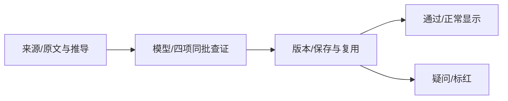

# 目标4：基础字段为何待核对

元素数、晶系、群号被跳过模型核对，摘要未继承来源通过状态；另一路径仍残留待核对标记。截图150GPa已通过；其他卡的200GPa被错引150GPa否定，原文有200GPa。

建议四项同批模型核验，计算查表供参考；绑定材料和压力，通过即保存复用，疑问才标红。

```mermaid
flowchart LR
 A[来源/原文与推导]-->B[模型/四项同批查证]
 B-->C[版本/保存与复用]
 C-->D[通过/正常显示]
 C-->E[疑问/标红]
```

[依据](evidence.json)
