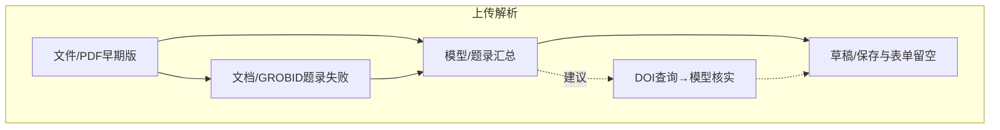

# 目标1：服务与题录

解析时本机8070无监听；现已恢复，退出原因未明。PDF为Early Edition，未印卷期页。Crossref同DOI同标题确认109卷17期6463–6466页；代码只查出版年，缺题录补全。

```mermaid
flowchart TD
subgraph 上传解析
 A[文件/PDF早期版]-->B[文档/GROBID题录失败]
 A-->C[模型/题录汇总]
 B-->C
 C-->D[草稿/保存与表单留空]
 C-.建议.->E[DOI查询→模型核实]
 E-.->D
end
```

[依据](evidence.json)
