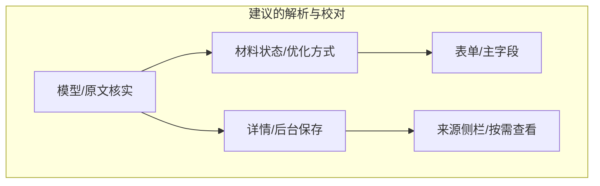

# 目标3：结构优化字段

10/15的#94加入主选项；10/30的#181新增8项详情，为区分优化目标、求力方法及几何约束。例如“体积”表示固定或优化，不是体积数值。当前空项也常驻展开，界面过重。

建议主表单只留“结构优化方式”，详情保留后台与来源侧栏，按需查看，不删旧数据。

```mermaid
flowchart TD
subgraph 建议的解析与校对
 A[模型/原文核实]-->B[材料状态/优化方式]
 A-->C[详情/后台保存]
 B-->D[表单/主字段]
 C-->E[来源侧栏/按需查看]
end
```

[依据](evidence.json)
