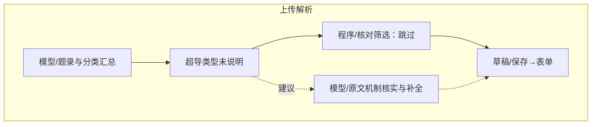

# 目标2：超导类型漏填

原文有电声耦合机制依据；整理后为unknown，，程序跳过该字段，未交模型补全。隔离重放确认调用为0。建议未知值也核对：模型依据全文判断，确定则补常规（声子介导）并保留推断出处，依据不足则保留未说明。

```mermaid
flowchart TD
subgraph 上传解析
 A[模型/题录与分类汇总]-->B[超导类型未说明]
 B-->C[程序/核对筛选：跳过]
 C-->D[草稿/保存→表单]
 B-.建议.->E[模型/原文机制核实与补全]
 E-.->D
end
```

[依据](evidence.json)
