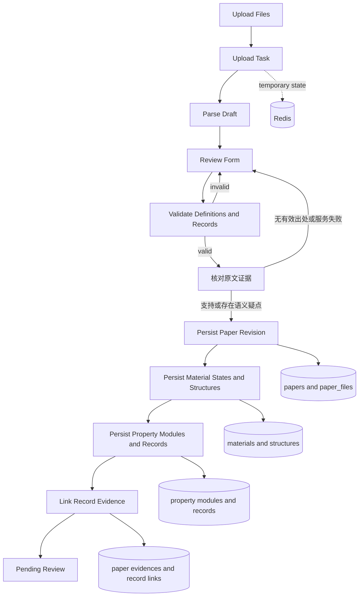

# 上传数据结构与表单映射

## 三入口统一展示

上传校对、审核编辑和论文详情共用研究材料/关系展示。研究材料从当前材料状态汇总，显示名称、化学式及状态入口；不恢复独立文本框。前两者可增删改论文对材料的研究关系，读取兼容数组与 JSON 字符串，修改保留页码、引句等来源字段；无法解析的历史值提示异常并保留原值。状态类型位于每个材料基本区，独立选择实验、理论、理论与实验或未知。材料状态默认展开，可手动折叠，核对通过不会删除字段。

结构附件复用 `CrystalStructureView`：宽容器左右等宽，左侧真实 3Dmol 模型，右侧晶格参数、按 a/b/c 向量逐行排列的矩阵和原子位置；原子位置默认分数坐标，可切直角坐标。模型与表格来自同一个解析模型，候选、晶胞及格式切换一起更新。窄容器上下排列，数值表内部滚动。无结构或解析失败明确显示空态，不显示上一结构的数据。

模型和数据区在宽容器各固定 400px 高；窄容器模型 280px、数据区 400px，宽度随容器适配。右侧长内容内部滚动，原子数量不撑高整行。此视图不再显示模型底部重复元素图例，旋转/缩放/重置工具位于画布内；其他独立查看器保留图例。上传草稿和审核编辑的整个附件区默认展开，可独立折叠，支持键盘；收起保留材料归属、文件、状态及精确来源核对入口，重开保留候选、晶胞、格式、坐标和模型视角。上传新结构后自动展开。折叠不修改科学数据或触发保存、核对失效。

上传保存、提交及科学状态修改保存时同步研究材料汇总；单纯打开历史记录不回填数据库。论文详情只读，并把结构模型放回所属材料状态，移除侧栏重复模型及结构原文块。相关实现与验证见 [Issue #103](../../specs/103-property-evidence-review/quickstart.md)。

## 功能说明

上传功能处理一份以论文 revision 为根、以材料状态为核心的层级草稿。用户上传论文和结构附件后，
系统在 Redis 中保存解析运行态；已经执行科学来源核对的草稿另在 MySQL 持久保存；正式提交前，前后端依据同一版本化
`FormDefinition` 校验模块化物性记录，提交事务只写 MySQL 目标契约。

本文只描述“超导数据去中心化上传”当前实际使用的数据结构。账号、审核事件、检索索引、外部数据集
和图表组合不属于本表单的直接写入范围。

## 数据存放分层

| 存放位置 | 数据 | 生命周期 | 作用 |
| --- | --- | --- | --- |
| Redis | `upload_task` 状态、上传文件清单、AI 解析草稿、用户校对结果、清理时间 | 创建任务后到任务清理或提交完成 | 支撑异步解析和可恢复校对，不是正式科研数据 |
| 文件存储 | 原始 PDF/TXT/MD、补充材料、CIF/POSCAR 附件 | 上传后保留；正式提交时作为论文文件保存 | 保存原始来源和结构附件 |
| MySQL | 论文 revision、材料状态、结构、模块化物性记录、定义和 Evidence | 用户提交后成为待审核正式记录 | 审核、检索和论文详情的关系型事实来源 |

“草稿”指可校对的 `draft` JSON，核对后由 `scientific_upload_drafts` 持久保存；提交成功前不会形成论文业务记录。“论文 revision”指
`papers.content_revision`。科学实体都携带或可追溯到 `paper_id + paper_revision`，不会把不同版本的
材料、结构、记录或 Evidence 混在一起。

## 表单与持久化映射

一个论文草稿可包含多个材料状态。同一化学式在不同压力、温度、磁场、理论/实验条件或空间群下，
应作为不同材料状态录入。

| 表单分组 | 关键字段 | 是否可重复 | 落库去向 |
| --- | --- | --- | --- |
| 论文基本信息 | 标题、期刊名、年份、期号、卷号、起始页码、DOI、摘要、作者 | 否 | `papers` |
| 论文分类与 AI 摘要 | 论文类型、超导体类别、材料家族、摘要、关键词、方法、主要发现、研究动机 | 材料家族可多选 | `papers`、`material_families`、`paper_material_families` |
| 上传文件 | 文件角色、原文件名、存储路径、SHA-256、大小、媒体类型、排序 | 是 | `paper_files` |
| 材料状态 | 材料名、化学式、元素数、材料维度、晶系、压力、温度、磁场、状态类型、报告空间群、备注 | 是，核心重复单元；材料名与化学式至少一项 | `material_states`；有化学式时关联 `chemical_systems`、`superconductors` |
| 结构家族 | 结构家族名称、是否主家族 | 每个状态可多选，最多一个主项 | `structure_families`、`material_state_structure_families` |
| 结构模型 | CIF/POSCAR 文本、格式、空间群、晶胞、原子数、计算方法、来源位置 | 每个状态可有多个 | `structure_models` |
| 物性模块 | 超导、动力学、热力学、电子性质 | 按需添加、排序和删除 | `property_modules` |
| 物性记录 | 类型、物性代码、原始值、规范值、单位、方法、代表标记、定义版本 | 每个模块可有多条 | `property_records` |
| Conditions 与参数 | 计算或实验 Conditions、lambda、omega log、mu*、网格、展宽及预留扩展字段 | 每条记录独立拥有 | `property_records.payload_json` |
| 论文证据 | 字段路径、章节、页码范围、原文引句 | 是 | `paper_chunks`、`paper_evidences`、`property_record_evidences` |

上传校对与管理员编辑共用书目行，顺序为期刊名、年份、期号、卷号、起始页码、DOI。
六列宽度比例为 4:1:1:1:1:4；窄屏保持一行并可在行内横向滚动。期号使用独立可空文本
`issue_number`（最长 100 字符），支持 `S1`、`3-4`，解析未报告时留空，不从年份或卷号猜测。
草稿归一化、保存重载和正式提交均保留期号。“起始页码”沿用 `pages` 文本，历史页码范围与
文章编号原样保留，DOI 校验及错误定位保持有效。（[Issue #99](../../specs/99-paper-metadata-row/spec.md)）

首批物性模块为 `superconductive_properties`、`dynamical_properties`、
`thermodynamic_properties` 和 `electronic_properties`。模块只在用户实际添加时提交；记录通过
`record_key` 在模块内保持稳定身份。预测 Tc 必须使用 `calculation_conditions`，测量 Tc 必须使用
`experimental_conditions`，两类 Conditions 互斥且都属于当前记录。

记录标题、定义选择和“添加记录”菜单仅显示类型、方法，不显示模板版本号；内部仍保留
`definition_key + definition_version`。每条记录默认展开，可在编辑态和只读态独立折叠；收起摘要
显示类型、方法、名称及结果（Tc 使用当前规范值，普通物性使用原始值），服务端校验或定义加载错误仍可见。新增、复制、删除其他条目不会
改变原记录的折叠状态，折叠也不会修改科学数据。

自定义性质使用 `record_type=property`、`property_code=custom` 和非空
`custom_property_key` 作为论文内稳定身份；预测 Tc、测量 Tc 及其他规范性质的
`custom_property_key` 始终为空。编辑器切换定义和加载历史 v2 草稿时会清理标准记录上的残留键，
自定义记录缺少键时补足稳定键；记录值、Conditions、Evidence、`record_key` 和定义版本保持不变。

“添加记录”的选项来自该物性模块已发布的记录定义，每个定义键取最新已发布版本；定义列表不可用时
使用内置候选引用，实际表单仍需加载对应定义。选项数量不由 AI 从当前论文或材料状态识别出的方法数决定。
同一状态可以保存多条相同或不同方法的 Tc，以及自定义性质；每条记录独立保存结果与条件。

测量 Tc 的实验 Conditions 使用一个多行文本框，当前描述写入本条
`payload.experimental_conditions.description`，保留换行；不再用六个固定输入和扩展字段编辑器。
旧记录没有 description 时，在界面中把原条件字段转换为可读文本；编辑后以 description 为当前显示
来源（空字符串也有效），同时保留旧字段和 Evidence，避免丢失原始信息。计算 Conditions 和参数仍使用
原有结构化表单。（[Issue #94](../../specs/94-property-record-editor/spec.md)）

测量和预测 Tc 的常用行紧凑排列名称、值类型、Tc 值及代表结果复选框，数值框内显示 K。
按卡片内容宽度响应：至少 640px 为单行，400–639px 为两列，更窄为单列；实验条件独占一行。
Tc 直接修改 value_number，范围修改上下界；不再显示“原始记录”或要求第二次填写数值。
当前类型对应的值是唯一来源，兼容列 value_raw 随当前值生成，数值和范围的 unit_raw 为 K，
文本和布尔的单位为空。前端加载、编辑、应用核对建议及后端保存共用各自的转换规则，
保存与导出不再保留被更正的旧 Tc 写法。缺少 raw 的有效 Tc 可以保存；普通物性契约不变。
临时小数或指数在输入框内保持文本，无效规范值为 null，上传草稿保存和管理员保存均先校验，
防止提交旧值；零值有效。Tc 摘要读取当前规范值，清空后提示待填写；代表结果继续受已有唯一性
规则约束。只读时同样只有当前值入口且控件禁用。旧 raw 字段核对提示定位到当前 Tc，
核对候选不再提供独立 raw/单位编辑；准备确认使用与保存一致的当前值表示。
字段核对仍通过标签与稳定记录身份定位。既有论文版本、修改历史、论文文件及 Evidence 不删除，
也不批量改写数据库中的历史数据。

材料状态编辑器按 `DraftMaterialState` 对象引用复用未修改卡片；修改一个状态时，其他状态的字段树不
重新构造。空间群符号自由输入保存在输入控件本地，选择标准候选、清空或失焦时才写回草稿；候选选择
仍同步写入空间群编号和晶系。物性记录编辑器按 `record_key` 隔离记录更新，动态 Schema 和客户端校验
结果按定义与记录引用缓存，定义绑定只在记录定义身份变化时重新加载或绑定。上述优化不改变 Redis 草稿
字段、自动保存时机、校验语义和提交接口。（[Issue #96](../../specs/96-upload-form-performance/spec.md)）

上传草稿和管理员编辑共用晶系联动：手动选择“未知”（包括再次选择已选中的“未知”）时，
一次清空当前状态的报告空间群符号和编号，以显式 `null` 保存；失焦和保存重载不会恢复旧值。
鼠标与键盘均可操作，后续输入有效群号或选择标准符号仍按原规则填写晶系。
加载历史记录本身不清理字段，其他材料状态、结构附件和物性不因这次选择而被编辑，
只读入口不发出修改。核对流程沿用实际科学字段变更通知与内容版本检查。
（[Issue #105](../../specs/105-crystal-unknown-reset/spec.md)）

这里的清空只针对用户填写的报告空间群，不覆盖结构文件解析出的对称性信息，也不更换材料状态的
稳定身份。保存请求明确携带两个字段的 `null`，而不是省略字段；因此重新读取不会把旧空间群带回。
当前空字段不再作为待核对科学项，依赖这些条件的物性断言按新内容重新判断，不能沿用旧确认。
鼠标、键盘及保存重载的验收路径见 [晶系未知联动验证](../../specs/105-crystal-unknown-reset/quickstart.md)。

材料状态缓存同时比较当前卡片的元素种类数临时输入；非法输入即时显示原有错误提示，但不写入草稿，
也不使其他材料状态卡片重新渲染。（[Issue #102](https://github.com/JLU-ICCMS-MaYuan/SC-Wiki/issues/102)）
例如输入 `0` 或 `119` 时，当前卡片显示“请输入 1–118 的整数”，保存载荷仍保留此前合法的
元素数。提示刷新不依赖草稿对象变化，不改变自动保存规则；五卡片回归验证只重绘当前卡片。

数值、范围、文本和布尔值通过固定核心列表达；`payload_json` 只保存定义声明的 Conditions、参数和
预留扩展字段。`0` 与 `false` 是有效值，不能按空值丢弃。每条记录绑定不可变的
`definition_key + definition_version`，后端依据该版本执行 JSON Schema、JSON Pointer 和业务规则校验。
记录通过可选 `structure_key=structure-{id}` 引用同一论文 revision、同一材料状态内的结构；Conditions
不重复保存 `structure_id`。完整 MaterialState 导出使用相同的 `structure_key` 标识结构并精确校验引用，
引用无法解析时返回 `409 export_incomplete`。

## MySQL 关系

### 论文、材料与结构

| 表 | 主键与主要关联 | 保存内容 |
| --- | --- | --- |
| `papers` | `id`；`content_revision` 是当前内容版本 | 书目信息、审核状态、上传者和 LLM 富化字段 |
| `paper_files` | `paper_id + paper_revision` | 正文、补充材料和附件元数据 |
| `paper_chunks` | 关联文件与论文 revision | 从正文切分出的可引用文本块 |
| `paper_evidences` | 关联 Chunk 与论文 revision | 字段路径、章节、页码和原文引句 |
| `chemical_systems` | 属于 `paper_id + paper_revision` | 元素体系键和元素列表 |
| `superconductors` | 属于 `paper_id + paper_revision`，关联化学体系 | 化学式、规范化化学式、组成和显示名 |
| `material_states` | 属于论文 revision，关联一个超导体 | 压力、温度、磁场、状态类型、晶系、报告空间群和备注 |
| `structure_models` | 关联材料状态与论文 revision | 结构文本、格式、哈希、空间群、晶胞和计算来源 |

`chemical_systems` 和 `superconductors` 都由论文 revision 拥有。同名 LaH10 出现在两篇论文时使用
不同主键，跨论文查询通过规范化学式、组成和体系键聚合，不通过共享材料实体关联。

### 模块化物性与定义

| 表 | 主键与主要关联 | 保存内容 |
| --- | --- | --- |
| `property_modules` | 关联一个 `material_state`；模块代码在该状态内唯一 | 按需挂载的模块及排序 |
| `property_records` | 关联模块、材料状态、论文 revision 和定义版本 | 固定检索列、值、单位、方法、代表标记和 `payload_json` |
| `property_record_evidences` | `property_record_id` ↔ `paper_evidence_id`，要求同 revision | 记录级或字段路径级来源 |
| `property_evidence_checks` | 关联当前论文 revision 与物性记录；记录删除时级联清理 | 内容和来源摘要、规则版本、模型结论与理由、证据快照 |
| `form_definitions` | `definition_key + version` 唯一 | JSON Schema、UI 提示、规则、状态和校验和 |
| `form_definition_audit_events` | 关联定义及操作者 | 发布、停用、升级、回滚和管理员提升审计 |

发布后的定义不可原地修改；停用版本仍可解释历史记录，但不能用于新建记录。记录升级与回滚均显式
执行并写审计事件，不会在读取时自动改写。管理员可将已批准的论文内自定义性质提升为全站定义；
提升不改变源记录、Evidence 或历史定义绑定。

`record_key` 在所属模块内标识记录，可以在不同材料状态或模块间复用。新记录未显式携带
`source_fingerprint` 时，后端按材料状态主键、模块键、记录键生成指纹；已有记录编辑时保留原指纹。
指纹用于记录身份去重，不代表论文或段落：多个记录可以共享论文和同一 Evidence，也不会因此被合并。
科学值变化由 `record_checksum` 表达，不改变已有来源身份。

### 证据保留与核对结果

压强数值区支持连续输入和粘贴，问题标签独立打开核对。清空规范值表示未知，同时清空 pressure_value_gpa、pressure_raw、pressure_unit_raw、pressure_min_gpa、pressure_max_gpa；零保留，未完成的小数或指数不会误删条件。原始值、单位和范围在折叠区域编辑，修改规范值不自动覆盖原始记录。上传规范化只对缺失字段读取旧条件，显式 null 保持为空。

解析草稿的单个 `evidence` 与多条 `evidences` 在表单边界合并、去重；空数组不会覆盖已有单证据。
编辑和保存保留原文来源，复制保留候选来源，新记录须重新核对。正式关联按材料状态、模块和记录联合
定位，不用全论文范围的 `record_key` 查找目标，允许不同状态或模块使用相同局部键。

`scientific_evidence_checks` 保存全部科学项的 unchecked、supported、uncertain、unsupported 和 missing，以及模型、理由、建议、来源版本与审核员裁决草稿。稳定 item_key 与当前字段路径分开，保存或排序后仍对应原科学项。修改使相关内容摘要失效，旧结果可查看但不能批准；纯补入证据不改变科学内容版本。

后台每组完成后持久保存，预检查不调用模型。`scientific_upload_drafts` 保存已核对草稿与最新生命周期，Redis 丢失后可恢复；必要原文不被普通到期清理删除。上传创建论文的事务将结果按稳定身份转为 paper 目标。Go 正式批准事务写入 `scientific_evidence_sources`、原文证据及历史，再删除临时核对项，失败全部回滚。

结构附件来源保存在 `scientific_structure_origins`，记录认证提交者、真实原始文件及解析依据；提交者不等同于作者。管理员可对无直接论文支持或提供者未知的内容逐条说明推理/专业判断依据后完成确认；保留人工来源，不能伪造原始提供者或论文引句。元素计数及明确原始单位的压力、温度转换由程序复核输入与规则。

## 提交流程

正式提交校验完整草稿、定义和物性证据核对结果，再在事务中写入论文 revision、材料状态、结构、模块、记录、
Evidence 关联与核对快照。有出处但存在语义疑点时进入待审；无出处或内容版本变化时停止提交。
任一校验失败都不会留下部分正式科研数据。旧缓存草稿只在输入边界单向转换为
Schema v2；v2 载荷和规范 property identity 不会再次被旧转换覆盖，正式持久化不再双写旧科学表。
模块化物性校验错误返回完整的 `material_states[i].property_modules[j].records[k]` 字段路径和
`issues[]` 具体消息，上传页面会汇总全部问题并展开、标记和聚焦首个可用错误位置。
来源指纹唯一约束冲突单独返回 `source_identity_conflict` 问题，明确说明内部身份冲突、无需修改科学数据，
不再误报局部记录键重复。相关修复与验收见 [Issue #98 Spec](../../specs/98-scoped-record-fingerprint/spec.md)。

## 关键约束

- 一个材料状态必须关联同一论文 revision 的超导体；结构、记录和 Evidence 不得跨 revision。
- 压力范围必须两端同时存在或同时缺失，且最小值不大于最大值；压力、温度和磁场数值不得为负。
- 报告空间群编号为空或位于 1 到 230；它不等同于结构文本解析出的确认空间群。
- 一个材料状态可关联多个结构家族，但最多一个主结构家族。
- 非空物性模块不能隐式级联删除；先显式处理记录，再删除模块。
- 每个“论文 revision + MaterialState + Tc 记录类型 + 方法”最多一条代表 Tc。
- 上传者提交普通科学数据须有当前来源内可复核的 Evidence；管理员批准或重新批准时也可使用已保存、绑定当前内容与来源版本的逐条人工决定，不能仅凭整篇审核意见绕过核对。结构提供者来源与确定性派生来源按上述独立规则核验，历史迁移不伪造缺失证据。
- 自定义字段只能出现在定义预留分组中，不能覆盖固定核心字段或系统键。

## 代码依据

- `backend/models.py`：Python SQLAlchemy 目标模型及数据库约束。
- `goserver/models/models.go`：Go 目标表映射。
- `backend/ingest/upload_contracts.py`：Schema v2 上传契约和旧草稿边界转换。
- `backend/ingest/property_modules.py`：模块化记录规范化与校验。
- `backend/ingest/scientific_drafts.py`：正式提交事务。
- `backend/services/form_definition_service.py`：定义生命周期和校验。
- `frontend/src/components/PropertyModuleEditor.tsx`：模块与记录编辑器。
- `frontend/src/lib/propertyModules.ts`：物性记录身份归一化与历史草稿兼容。
- `frontend/src/components/UploadTaskEditor.tsx`：提交错误汇总和问题定位。
- `frontend/src/components/SchemaDrivenRecordForm.tsx`：定义驱动表单。
- `frontend/src/lib/formDefinitions.ts`：记录定义加载、版本筛选及实验条件文本校验。
- `tests/01_decentralized_uploading/property-record-editor.test.tsx`：单框、标题、独立折叠与原始信息保留验证。
- `backend/tests/test_property_record_conditions.py`：逐记录条件从 AI 提取调用、归一化到持久化及导出的往返验证。

## 当前边界

- 解析运行态由 Redis 管理，已核对草稿另有 MySQL 恢复快照，正式提交后通过 `papers.upload_task_id` 回溯来源任务。
- 结构附件只有经用户确认后才持久化为 `structure_models`；浏览器中的结构候选不等于正式记录。
- 本文描述应用当前目标契约和隔离 MySQL 已验证行为，不表示任一生产数据库已经执行迁移。
- 审核后的向量发布、检索索引和 Neo4j/Qdrant 生命周期不属于上传表单直接写入范围。

## 相关变更记录

- [Feature #90：MaterialState 模块化物性与动态表单](../../specs/90-unified-superconductor-properties/spec.md)
- [Feature #94：物性记录标题、实验条件文本与独立折叠](../../specs/94-property-record-editor/spec.md)
- [Bug #96：上传解析记录表单选项编辑延迟](../../specs/96-upload-form-performance/spec.md)
- [Feature #103：物性证据保留、自动补证与人工裁决](../../specs/103-property-evidence-review/spec.md)
