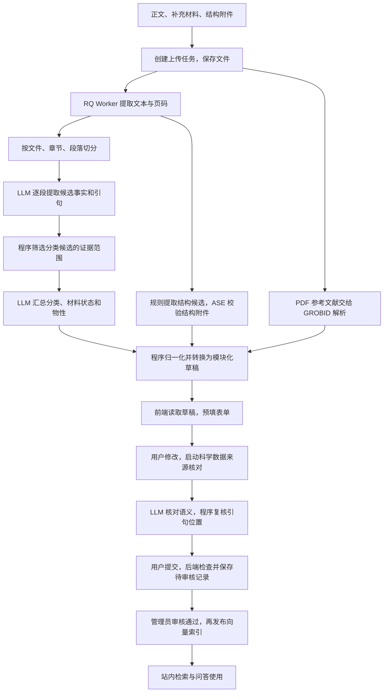

# 上传功能的 LLM 工作链路与 Agent 抽象分析

本文回答三个问题：现在系统怎样读超导论文并填写表单；提示词为什么这样组织；上传与问答能否共用 Agent 能力。

核对日期：2026-09-18。依据是当前上传、来源核对、表单和问答代码；未完成的 Spec 不作为已实现能力的证据。第七、八节是应本次问题给出的架构分析与建议，不表示功能已经实现或已决定实施，也不维护后续任务状态。当前功能入口仍是[上传总览](README.md)。

## 一、先回答：可以抽象成上传 Agent 吗？

**可以。现有上传功能已经具备完成这项任务的大部分执行能力，适合先封装成一个有明确输入、输出和边界的上传 Agent。** 如果希望它自己判断“信息不够，下一步应读附件还是检索资料”，还需要增加工具选择和结果反馈的循环。

你的理解抓住了核心：表单里的每个字段，都可以看成一个需要依据论文回答的问题。例如，“这个材料在什么压力下，用什么方法，得到多少 Tc？”系统最终需要的不是一段聊天回答，而是一组带材料、条件和来源的记录。

当前实现可以更准确地描述为：

> 程序安排阅读顺序 → LLM 从每段提取候选事实 → LLM 汇总 → 程序归一化成表单草稿 → 用户校对并核对来源 → 提交待审核。

这里有三个容易混淆的概念：

| 概念 | 通俗解释 | 对应本项目 |
| --- | --- | --- |
| LLM 结构化提取 | 读一段文字，按指定格式交出答案 | 从论文中提取 Tc、压力、方法和原文引句 |
| RAG（检索增强生成） | 先找相关资料，再把资料交给模型回答 | 问答通过工具检索站内论文片段和物性记录 |
| Agent | 围绕目标，按结果选择工具和下一步行动 | 问答 Mentor 可以选择检索工具，读结果后再继续回答 |

**当前上传主流程不是典型的“向量检索 → 回答”，而是逐段遍历的文档提取工作流。** 它不在生成草稿前调用 Qdrant 找前几个相关片段。来源核对同样扫描当前论文及附件的来源片段。广义上两者都在给模型提供证据，但其执行方式与问答 RAG 不同。

本文所说的“思考链路”，指代码可观察的输入、步骤、判断规则和输出。分段 JSON、原文引句、核对理由可以检查；它们并不是模型内部逐字思维的记录。

## 二、从论文到表单，实际经过哪些环节？



页面的“五步进度”是任务状态：保存文件、提取正文、分段阅读、汇总草稿、等待校对。来源核对、正式提交和管理员审核发生在后续流程，并非五次模型调用。

### 1. 把文件变成模型能读的文本

入口是 `backend/ingest/upload_jobs.py` 的 `process_upload_task` / `_process_upload_task`。Redis 保存任务运行态，RQ Worker 执行耗时工作，并加载本次任务选择的模型配置。

PDF 由 `pdf_extractor.py` 使用 PyMuPDF 提取文本，并插入 `<!-- page: N -->` 页标记。TXT/MD 直接读取。多文件保留各自文件身份，正文与附件的事实可以追溯到来源文件。

**当前这条 PDF 路径没有调用视觉模型或 OCR。** 图片只生成 Markdown 占位引用，并不把图像内容发给模型。图中曲线、扫描表格里的数据，如果没有进入提取文本，就不能指望后面的提示词读到它。

结构处理是另一条支路：文本中的结构候选由 `structure_extractor.py` 按规则提取；CIF/POSCAR 附件走结构解析与 ASE 校验。候选还需要分配材料状态并确认，不能仅凭 LLM 描述就变成已确认结构。

参考文献由 GROBID 从正文 PDF 解析。这是参考文献解析服务，不是让模型上网搜索论文。

### 2. 切成小段，逐段提出固定的一组问题

`chunker.py` 按章节和段落切分，默认以约 800 tokens 为目标，用字符数粗略估算；这不是严格的 token 上限。`_chunks_with_preamble` 另外补上首页与摘要，并附上来源页码。

`_read_chunk` 对每段调用一次 LLM。每次输入相当于：

```text
固定规则：你要提取哪些事实、返回什么 JSON、怎样保留证据。
本段信息：章节、页码、分段编号。
本段正文：实际提取出来的论文文字。
```

每段阅读是独立调用，不是模型一直记得之前所有段落的长对话。跨段信息依靠返回的候选 JSON 传给后面的汇总步骤。

候选结果包括元信息、论文类型证据、研究材料、材料状态、Tc、其他物性、方法和发现。结果写入 `review_artifacts/{task_id}/chunks/`，有效缓存可复用；当前缓存契约版本为 `CHUNK_RESULT_SCHEMA_VERSION = 8`。任一分段处理异常会使解析任务失败，不会把该段悄悄跳过后宣称完成。

### 3. 先区分“本文做的研究”和“本文引用的研究”

提示词要求候选标记：

- `current_paper`：本文作者实际完成的工作。
- `referenced_work`：前人研究、引用论文或背景介绍。

例如，一篇计算论文的引言写“前人通过实验发现了某材料的超导性”，不能因此把本文归为实验论文，也不能把前人的 Tc 当作本文测量值。

这里不只依赖提示词。`_summary_classification_candidates` 会在汇总前筛选论文类型、材料状态及相关分类候选，要求具有当前论文的范围标记。`referenced_materials` 是后台辅助信息，不进入最终草稿。

这仍依赖模型最初是否正确判断证据主体；代码筛选能够执行规则，但不能保证模型标记本身一定正确。

### 4. 汇总整篇论文的候选事实

汇总调用的输入是所有分段候选的 JSON，不是再次原样发送整篇 PDF。`SUMMARY_SYSTEM_PROMPT` 要求模型去重、整合跨段信息，并给出论文分类和结构化草稿。

分段阶段回答“这里说了什么”，汇总阶段回答“放到整篇论文里，这些事实应怎样组织”。例如，方法段报告 Allen-Dynes 方法，结果段报告某压力下的 Tc，汇总时需要把它们放到正确的材料状态和结果中。

分类包含明确的业务约定。例如：

- 理论提出主要结论、实验主要用于验证，论文归 `theoretical`。
- 实验发现主要现象、理论用于解释，论文归 `experimental`。
- 理论与实验同等重要且无法分主次，也归 `experimental`。
- 理论二级类型限定为 `calculation`、`method`、`theory`。

这些是本项目希望采用的分类口径，不是模型自然就会遵守的唯一学术分类法。因此必须写清楚。

### 5. 用程序把模型答案变成真正的表单数据

模型不操作网页，也不逐个点击输入框。它返回 JSON，后端转换为草稿，前端再把草稿字段绑定到控件。

这里有一层很关键的转换：**提示词仍主要使用 `tc_results` / `properties` 提取结构，当前表单和持久化使用 `property_modules[].records[]`。** `_normalize_draft` 最终调用 `convert_legacy_scientific_draft` 完成转换。

例如，一条理论 Tc 结果会转换为：

```text
材料状态：材料、压力、结构等
└── 物性模块：superconductive_properties
    └── 记录：predicted_tc
        ├── property_code：tc
        ├── value_number 或 value_min/value_max
        ├── canonical_unit：K
        ├── method_code：allen_dynes 等
        ├── payload.calculation_conditions
        └── evidence：来源引句
```

实验 Tc 则转换为 `measured_tc`，使用 `payload.experimental_conditions`。同一状态下多条结果分别保留自己的条件。

归一化还包括枚举处理、原始数值与范围解析、元素数计算、空间群号与晶系映射等。根据论文级研究方法推断超导体类型或逐条 Tc 方法的自动补全已移除；这类结果在提取后作为待采用字段建议生成，用户确认前不写入字段。

因此，最终表单值可能来自直接提取、LLM 归纳、代码转换或规则推导，不能一概理解为“原文逐字写了这个值”。

`UploadTaskEditor.tsx` 获取草稿并填写论文字段，`MaterialStatesEditor.tsx` 展示材料状态和物性模块；提交时再经过后端契约、物性定义和持久化校验。表单能增加某类字段，不等于现有提取提示词已经能完整提取这种字段。

### 6. 另行检查“填入的内容是否真有论文依据”

`property_evidence.py` 的核对流程接收两类输入：待核对的科学声明，以及当前论文和附件的原文片段。

它扫描来源，按约 24,000 字符组织来源批次，每组最多核对 8 条记录；这些是分组目标，并不代表严格的模型上下文容量保证。它没有用向量排名截断整篇来源。

模型分别返回支持、不支持、有歧义、未找到等结果。随后程序再次定位引句，检查来源文件、片段和必要的页码信息，允许排版空白差异，但不会把 `3.78 K` 当作 `3.79 K`。

这两个检查解决不同问题：

| 检查 | 回答什么 | 不能单独证明什么 |
| --- | --- | --- |
| 程序定位原文 | 引句确实存在于这份来源里吗？ | 这句话真的支持所填科学结论吗？ |
| LLM 判断语义 | 这句话说的是该材料、该条件下的这个物性吗？ | 模型判断一定正确吗？ |

有原文但存在语义冲突的记录，可以保留疑点进入待审核流程；没有有效来源且未采用可用建议的上传内容会被相应检查拦下；明确采用的通用知识推测可进入待审，正式批准仍需管理员逐项说明理由。用户仍需决定修改、采纳建议或提交，管理员承担后续裁决。详细操作见[PDF 解析管线](pdf-parsing-pipeline.md)。

### 7. 保存待审核记录，再供问答使用

提交接口检查任务归属、草稿内容、来源核对结果和数据约束，再保存论文及科学实体。上传解析成功、提交成功、审核通过、向量发布是不同状态。

草稿与审核快照保留 AI 初始值、用户最终值和来源信息；论文审核通过并执行发布后，片段才进入相应向量索引。结构化物性工具读取当前已批准版本的记录。上传负责生产候选知识，审核决定哪些知识可被后续正式使用。

## 三、那些提示词分别在做什么？

### 当前主链路实际使用的提示词

| 位置 | 调用时机 | 模型看到什么 | 主要输出 |
| --- | --- | --- | --- |
| `upload_jobs.py::CHUNK_SYSTEM_PROMPT` | 逐段阅读 | 单个分段及章节、页码 | 候选事实、范围标记、引句 |
| `upload_jobs.py::SUMMARY_SYSTEM_PROMPT` | 所有分段处理后 | 筛选后的分段候选 JSON | 整篇论文分类及科学数据草稿 |
| `upload_jobs.py::EXPERIMENTAL_CONDITIONS_PROMPT` | 拼接进上述两种提示词 | 随各阶段输入一起发送 | 每条实验 Tc 的条件描述；它不是第三次独立调用 |
| `property_evidence.py::SYSTEM_PROMPT` | 用户启动来源核对后 | 待核对记录与来源批次 | 逐条核对结果、引句、理由及有依据的可选建议 |

它们合起来像一份拆成几个环节的工作说明：每个环节只要求模型交出该环节需要的结果。

### 提示词包含的六类约束

| 约束 | 实际作用 | 项目例子 |
| --- | --- | --- |
| 任务和输入范围 | 告诉模型现在负责哪一步 | 分段只提候选，汇总才确定论文整体类型 |
| 输出结构 | 让程序能读取答案 | `material_states`、`tc_results`、`evidence` |
| 领域含义 | 防止提取数值却认错物性 | 测量时温度不等于临界温度 Tc |
| 分类与归属 | 防止把不同对象混在一起 | 本文与前人工作分开，不同压力状态分开 |
| 缺失处理 | 允许模型承认没有依据 | 返回 `null`、空数组或 `unknown` |
| 表达和证据 | 保留可追溯内容并统一生成文字 | AI 归纳字段用英文，原文 `quote` 保持来源语言 |

例如，实验条件提示词要求从样品、制备方式、测量方法、装置、外场、压力不确定度六方面阅读，但没有要求六项必须齐全。它希望模型识别信息，不希望模型为了填满表格而补造条件。

语言也有意区分：中文界面不意味着模型生成的论文摘要、研究动机等字段存中文。提取提示要求相关生成字段用英文，语言检查对指定字段中的汉字字符进行拦截；标题、摘要原文、作者和引句等来源内容保留原文。这类检查不是对“英文质量”的完整认证。

### 每次到底怎样把提示词发给模型？

统一 JSON 调用在 `backend/rag/llm.py`，核心形式是：

```python
messages = [
    {"role": "system", "content": system_prompt},
    {"role": "user", "content": user_prompt},
]
response_format = {"type": "json_object"}
temperature = 0.1
```

`system_prompt` 放工作规则，`user_prompt` 放当前分段、候选事实或核对数据。接口流式收集结果，结束后解析 JSON；汇总时还可以显示部分草稿。默认对指定连接、超时和 JSON 格式异常额外重试一次。

这里没有传入上传 Agent 的工具列表，也没有接收 `tool_calls` 后自动搜索网页的循环。设置角色为“专家”或把温度调低，都不会让接口自动获得搜索能力。

`json_object` 约束回答采用 JSON，并不等于服务端把完整字段 Schema 交给模型做严格约束，更不保证科学事实正确。后面的格式校验、归一化、引句定位和人工审核仍有独立作用。

### 为什么有些文件也有提示词，却不在这条流程里？

仓库保留了旧摄入路径。`extractor.py::SYSTEM_PROMPT` 和 `enrich_papers.py` 的提取逻辑不是当前多文件 Worker 的两次提取阶段。当前 Worker 从 `extractor.py` 复用 `_parse_result`，不意味着调用了那里的全文提取提示词。

因此，修改提示词时必须沿调用链确认入口；不能看见名字叫 `extractor` 就认为它控制当前上传页面。问答与灵感探索也有自己的提示词，它们负责回答问题或生成研究建议，并不都发送给一次上传任务。

## 四、用一组示意数据走一遍

以下是说明处理方式的假设文本，不对应真实论文的科学结论：

```text
引言：Previous work measured a Tc of 190 K in material X.
结果：For material Y at 150 GPa, we predict a Tc of 210 K
      using the Allen-Dynes equation.
```

预期处理是：

1. 引言的 190 K 标记为前人工作，不能成为本文的测量记录。
2. 结果段提取材料 Y、150 GPa、理论 Tc 210 K、Allen-Dynes 方法和对应引句。
3. 汇总时将这些事实组织到对应材料状态；如果还有 Y 在 180 GPa 的结果，应另设压力状态。
4. 归一化把理论 Tc 转换为 `predicted_tc` 记录，把数值、单位、方法及条件分开保存。
5. 前端在相应输入框显示 210 K 和 150 GPa，用户可以修改。
6. 核对时检查引句是否存在、描述是否真的支持“该状态下的理论 Tc 为 210 K”。

另一个例子直接来自现有核对提示词：

> “在 4.29 K 测得阈值电流 0.12 A”，不支持“Tc = 4.29 K”。

这解释了为什么“找到一个带 K 的数并填表”不够：正确任务是识别物理含义。即使引句完全真实，也可能不能支持所填字段。

## 五、上传和网站问答，哪些相同，哪些不同？

| 维度 | 当前上传 | 当前普通问答 |
| --- | --- | --- |
| 目标 | 生成可校对、可提交的结构化数据 | 回答用户的问题 |
| 输入范围 | 本次论文正文及附件 | 用户问题、对话历史、可用站内资料 |
| 如何取得内容 | 按程序安排逐段遍历，核对时按批扫描 | Mentor 可选择物性、文献或图谱工具 |
| 下一步由谁决定 | 上传 Worker 和核对程序 | 模型工具调用与 LangGraph 路由共同决定 |
| 输出 | 草稿、记录、来源及核对结果 | 自然语言回答及相关工具结果 |
| 写入责任 | 经用户提交进入待审核数据 | 普通问答工具提供查询能力 |
| 公网搜索 | 当前主流程未接入 | 当前 Mentor 工具列表未提供公网搜索工具 |

普通问答入口 `rag/service.py` 最终调用 `rag/agent/mentor.py`。它已经使用 LangGraph，基本循环是：

```text
模型读问题 → 选择工具 → 程序执行工具 → 模型读工具结果 → 继续调用或结束
```

可用工具包括 `search_literature`、`query_properties`、`material_info`、论文上下文与图谱关系工具。路由限制最多经过 5 轮工具执行；一轮可以包含多个工具调用，不应理解为严格最多 5 个单独请求。

`search_literature` 查的是站内向量库；名称中的“检索文献”不代表检索整个互联网。普通问答也不必每次都使用同一套 SQL 与向量融合流程，实际取决于模型选择的工具。另有显式启用的灵感探索路径，不能与普通问答混为一谈。

上传和问答已经共用请求级模型配置及客户端工厂，但上层调用方式不同：上传主要通过 `complete_json`，Mentor 通过带工具的 `ChatOpenAI`。

## 六、当前实现的能力边界

这些边界决定了 Agent 化究竟需要补什么：

- **图片信息可能未进入模型。** 改提示词不能恢复当前 PDF 提取器没有读取的扫描文字或曲线数据。
- **分段结果是一次信息压缩。** 某个条件若在分段阶段漏掉，汇总只读候选 JSON，未必能补回来；后续来源核对也不能保证发现所有从未提取出的记录。
- **汇总并非无限容量。** 所有候选汇总为一次输入，代码没有在这里构建多层递归汇总。论文和附件很长时仍受模型上下文限制。
- **业务规则与输出格式分散在提示词和程序中。** 当前提取结构与模块化表单之间还有转换层；未来只更新一侧，可能出现漏字段或语义不一致。
- **规则推导不等于论文直接报告。** 根据空间群推导晶系、根据方法补分类，都需要与直接引文区分。
- **核对有成本，也可能判断错。** 假设有 N 个未缓存分段，基础提取约为 N 次分段调用加 1 次汇总；额外还有重试和独立核对。核对调用量约为来源批次数乘以待核对记录分组数，每组最多 8 条。

例如，20 个未缓存分段，基础提取约 21 次调用。若另有 17 条待核对记录和 4 个来源批次，核对约需 `ceil(17/8) × 4 = 12` 次调用。这只是调用量示意，不含重试，不能直接当作费用或时延测量。

## 七、如何理解“抽象成上传 Agent”？（架构分析）

### 第一层：把现有能力封装为一个任务入口

最小抽象可以是“接收论文文件，返回带证据的可校对草稿”。内部仍由现有 Worker 执行固定步骤。这能统一接口和复用能力，但仅命名为 Agent 不会产生自主搜索能力。

适合保留的职责划分是：

| 部分 | 建议承担的责任 |
| --- | --- |
| 上传任务 | 文件身份、任务进度、缓存、取消和错误恢复 |
| 文献处理能力 | 提取文本、读指定片段、查找原文、解析附件 |
| LLM 提取与判断 | 识别事实、整理候选、解释歧义 |
| 数据契约与验证 | 字段类型、单位、状态归属、版本、来源定位 |
| 校对与提交 | 用户修改、采纳建议、权限校验和事务落库 |

### 第二层：在确实需要时增加有限的自主行动

真正增加 Agent 能力的地方，是模型能够根据缺失或冲突选择下一步。例如：

> “正文报告了 Tc，但条件说明指向补充材料。读取附件里的对应表格，再判断是否能补全这条记录。”

概念上的循环可以是：

```text
已有候选事实
→ 找出缺失项或冲突
→ 从允许的工具中选择下一步
→ 取得新的来源或校验结果
→ 更新候选草稿
→ 达到完成条件，或报告仍不确定的字段
```

可包装的工具包括读取来源片段、搜索当前论文及附件、校验记录、核对引句、解析结构候选。需要新增的公网搜索工具应有独立边界。上述是建议接口职责，不是当前已经存在的一组函数名。

任务应有调用次数、时间和费用预算，并允许以“仍有缺失项”结束。停止条件应是关键内容有出处、满足契约、剩余疑点已明确，而不是强迫模型把每个输入框都填满。

上传与问答值得共用的是模型访问、文献读取、检索工具和来源描述；两者分别保留任务提示词、来源范围及输出契约。直接复用 Mentor 的整套行为并不合适：它的提示词面向苏格拉底式问答，而上传要求持续处理文件并交出结构化结果。

按当前需求，先有一个上传协调者和清晰的工具接口就能表达这套设计。是否需要多个 Agent，应由实际任务复杂度和验证效果决定。

## 八、联网搜索应怎样参与？（建议，尚未接入上传）

联网不是每次提取都必需。如果正文和用户提供的附件已经包含充分证据，直接读取这些来源更容易控制归属和复核。

联网更适合解决“资料缺失或身份核实”，而不是用外部常识填补本文没有报告的实验结果：

| 情形 | 可考虑的联网用途 | 对草稿的处理建议 |
| --- | --- | --- |
| PDF 缺少完整出版信息 | 查出版社或 DOI 元数据 | 保留外部来源，并确认是同一论文及版本 |
| 正文指向未上传的补充材料 | 查找同一论文的官方附件 | 核实身份后作为新来源读取并重新核对 |
| 本文没有给出某个 Tc | 查相关研究帮助理解 | 外部论文的 Tc 应保留在其自己的来源下 |
| 文中术语难以理解 | 查背景或方法资料 | 辅助解释，不把背景知识标成本文原文 |

例如，在网上找到另一篇关于同一材料的 220 K 结果，不能用来填补当前论文缺失的 Tc。材料相同，不代表压力、结构、样品、方法和论文归属相同。

接入时应记录外部来源的 URL、论文身份、版本、取得时间和引用内容，并对工具访问范围、调用预算和来源可靠性做限制。网页和论文内容都应作为待分析数据，不能允许其中的文字改变系统任务或操作权限。

当前来源核对提示词明确要求“只使用输入的当前论文及附件，禁止外部知识”。因此，联网补证涉及来源模型、核对契约和界面归因的调整，不能只加一句“必要时上网搜索”。

**建议的判断标准是：Agent 是否更完整地找到有出处的数据、更准确地区分条件和来源，并降低人工修正量。** 是否使用 Agent 框架、提示词是否更长，都不能单独证明提取质量变好。

## 九、代码与现有验证依据

以下链接用于继续查阅实现；本文只做了代码、现有测试内容及文档链接核对，没有运行上传流程、调用外部模型，也没有重新测量提取准确率。

| 想确认的内容 | 代码入口 |
| --- | --- |
| 上传步骤、两阶段提示词和规则归一化 | [upload_jobs.py](../../../backend/ingest/upload_jobs.py)：`_process_upload_task`、`_read_chunk`、`_normalize_draft` |
| PDF 文本和分段输入 | [pdf_extractor.py](../../../backend/ingest/pdf_extractor.py)、[chunker.py](../../../backend/ingest/chunker.py) |
| JSON 调用参数和重试 | [llm.py](../../../backend/rag/llm.py)、[llm_client.py](../../../backend/rag/llm_client.py) |
| AI 生成字段语言检查 | [language_contract.py](../../../backend/ingest/language_contract.py) |
| Tc 到模块化记录的转换 | [upload_contracts.py](../../../backend/ingest/upload_contracts.py)：`convert_legacy_state` |
| 物性字段和定义校验 | [property_modules.py](../../../backend/ingest/property_modules.py) |
| 来源核对和引句定位 | [property_evidence.py](../../../backend/ingest/property_evidence.py)：`SYSTEM_PROMPT`、`run_evidence_job`、`locate_with_reason` |
| 结构候选和参考文献支路 | [structure_extractor.py](../../../backend/ingest/structure_extractor.py)、[citation_graph.py](../../../backend/services/citation_graph.py) |
| 表单取值与展示 | [UploadTaskEditor.tsx](../../../frontend/src/components/UploadTaskEditor.tsx)、[MaterialStatesEditor.tsx](../../../frontend/src/components/MaterialStatesEditor.tsx) |
| 提交与发布 | [rag.py](../../../backend/api/rag.py)：`submit_upload_draft`、`publish_approved_paper` |
| 普通问答与工具循环 | [service.py](../../../backend/rag/service.py)、[mentor.py](../../../backend/rag/agent/mentor.py)、[tools.py](../../../backend/rag/agent/tools.py) |
| 分段、范围过滤及规则推导的测试 | [test_upload_jobs.py](../../../backend/tests/test_upload_jobs.py) |
| 引句定位、伪造来源及过期结果的测试 | [test_property_evidence.py](../../../tests/01_decentralized_uploading/test_property_evidence.py) |

上述测试文件能帮助理解系统预期约束，但模拟模型响应的测试不能证明真实 LLM 在任意论文上都会正确提取。后续若评估 Agent 方案，应使用同一批标注论文比较字段正确率、记录遗漏、来源定位、条件混淆、人工修正量以及调用成本。
