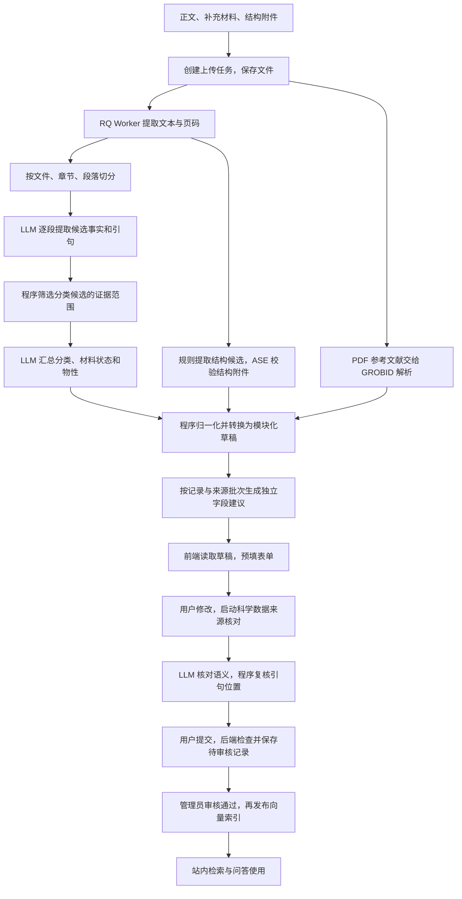

# 上传功能的 LLM 工作链路与 Agent 抽象分析

本文回答三个问题：现在系统怎样读超导论文并填写表单；提示词为什么这样组织；上传与问答能否共用 Agent 能力。

初版核对日期：2026-09-18；本次补充核对日期：2026-09-19。本文区分当前代码事实、用户已明确的设计要求和待验证的建议。第七、八节及第十节之后的设计分析不表示已经实现，也不维护后续任务状态。当前功能入口仍是[上传总览](README.md)。

本次只更新文档。阅读顺序建议：先看第十八节的 Agent 框架，再看第十、十一节的分流和提速方案，最后看具体字段与来源约束。

| 本次问题 | 对应章节 |
| --- | --- |
| 遇到不同论文内容，提示词如何处理 | 第十节 |
| 整篇 PDF 阅读与逐条证据如何兼顾 | 第十一节 |
| 提取结构与当前表单如何统一 | 第十二节 |
| Tc 方法自动填写及图表筛选 | 第十三节 |
| 原语言保存、按网站语言显示 | 第十四节 |
| 工具列表与工具调用循环是什么 | 第十五节 |
| 是否移除旧 extractor.py | 第十六节 |
| 六项能力边界各自怎样解决 | 第十七节 |
| 从零设计科研 Agent 与本项目架构 | 第十八节 |
| 联网只补出版信息与解释术语 | 第八节、第十九节 |
| 开源项目与论文调研依据 | 第二十节 |

## 一、先回答：可以抽象成上传 Agent 吗？

**可以。现有上传功能已经具备完成这项任务的大部分执行能力，适合先封装成一个有明确输入、输出和边界的上传 Agent。** 如果希望它自己判断“信息不够，下一步应读附件还是检索资料”，还需要增加工具选择和结果反馈的循环。

你的理解抓住了核心：表单里的每个字段，都可以看成一个需要依据论文回答的问题。例如，“这个材料在什么压力下，用什么方法，得到多少 Tc？”系统最终需要的不是一段聊天回答，而是一组带材料、条件和来源的记录。

当前实现可以更准确地描述为：

> 程序安排阅读顺序 → LLM 从每段提取候选事实 → LLM 汇总 → 程序归一化成表单草稿 → 单独生成字段建议 → 用户校对并核对来源 → 提交待审核。

这里有三个容易混淆的概念：

| 概念 | 通俗解释 | 对应本项目 |
| --- | --- | --- |
| LLM 结构化提取 | 读一段文字，按指定格式交出答案 | 从论文中提取 Tc、压力、方法和原文引句 |
| RAG（检索增强生成） | 先找相关资料，再把资料交给模型回答 | 问答通过工具检索站内论文片段和物性记录 |
| Agent | 围绕目标，按结果选择工具和下一步行动 | 问答 Mentor 可以选择检索工具，读结果后再继续回答 |

**当前上传主流程不是典型的“向量检索 → 回答”，而是逐段遍历的文档提取工作流。** 它不在生成草稿前调用 Qdrant 找前几个相关片段。来源核对同样扫描当前论文及附件的来源片段。广义上两者都在给模型提供证据，但其执行方式与问答 RAG 不同。

本文所说的“思考链路”，指代码可观察的输入、步骤、判断规则和输出。分段 JSON、原文引句、核对理由可以检查；它们并不是模型内部逐字思维的记录。

## 二、从论文到表单，实际经过哪些环节？



页面的“五步进度”是任务状态：保存文件、提取正文、分段阅读、汇总草稿、等待校对。来源核对、正式提交和管理员审核发生在后续流程，并非五次模型调用。

### 1. 把文件变成模型能读的文本

入口是 `backend/ingest/upload_jobs.py` 的 `process_upload_task` / `_process_upload_task`。Redis 保存任务运行态，RQ Worker 执行耗时工作，并加载本次任务选择的模型配置。

PDF 由 `pdf_extractor.py` 使用 PyMuPDF 提取文本，并插入 `<!-- page: N -->` 页标记。TXT/MD 直接读取。多文件保留各自文件身份，正文与附件的事实可以追溯到来源文件。

**当前这条 PDF 路径没有调用视觉模型或 OCR。** 图片只生成 Markdown 占位引用，并不把图像内容发给模型。图中曲线、扫描表格里的数据，如果没有进入提取文本，就不能指望后面的提示词读到它。

结构处理是另一条支路：文本中的结构候选由 `structure_extractor.py` 按规则提取；CIF/POSCAR 附件走结构解析与 ASE 校验。候选还需要分配材料状态并确认，不能仅凭 LLM 描述就变成已确认结构。

参考文献由 GROBID 从正文 PDF 解析。这是参考文献解析服务，不是让模型上网搜索论文。

### 2. 切成小段，逐段提出固定的一组问题

`chunker.py` 按章节和段落切分，默认以约 800 tokens 为目标，用字符数粗略估算；这不是严格的 token 上限。`_chunks_with_preamble` 另外补上首页与摘要，并附上来源页码。

`_read_chunk` 对每段调用一次 LLM。每次输入相当于：

```text
固定规则：你要提取哪些事实、返回什么 JSON、怎样保留证据。
本段信息：章节、页码、分段编号。
本段正文：实际提取出来的论文文字。
```

每段阅读是独立调用，不是模型一直记得之前所有段落的长对话。跨段信息依靠返回的候选 JSON 传给后面的汇总步骤。

候选结果包括元信息、论文类型证据、研究材料、材料状态、Tc、其他物性、方法和发现。结果写入 `review_artifacts/{task_id}/chunks/`，有效缓存可复用；当前缓存契约版本为 `CHUNK_RESULT_SCHEMA_VERSION = 8`。任一分段处理异常会使解析任务失败，不会把该段悄悄跳过后宣称完成。

### 3. 先区分“本文做的研究”和“本文引用的研究”

提示词要求候选标记：

- `current_paper`：本文作者实际完成的工作。
- `referenced_work`：前人研究、引用论文或背景介绍。

例如，一篇计算论文的引言写“前人通过实验发现了某材料的超导性”，不能因此把本文归为实验论文，也不能把前人的 Tc 当作本文测量值。

这里不只依赖提示词。`_summary_classification_candidates` 会在汇总前筛选论文类型、材料状态及相关分类候选，要求具有当前论文的范围标记。`referenced_materials` 是后台辅助信息，不进入最终草稿。

这仍依赖模型最初是否正确判断证据主体；代码筛选能够执行规则，但不能保证模型标记本身一定正确。

### 4. 汇总整篇论文的候选事实

汇总调用的输入是所有分段候选的 JSON，不是再次原样发送整篇 PDF。`SUMMARY_SYSTEM_PROMPT` 要求模型去重、整合跨段信息，并给出论文分类和结构化草稿。

分段阶段回答“这里说了什么”，汇总阶段回答“放到整篇论文里，这些事实应怎样组织”。例如，方法段报告 Allen-Dynes 方法，结果段报告某压力下的 Tc，汇总时需要把它们放到正确的材料状态和结果中。

分类包含明确的业务约定。例如：

- 理论提出主要结论、实验主要用于验证，论文归 `theoretical`。
- 实验发现主要现象、理论用于解释，论文归 `experimental`。
- 理论与实验同等重要且无法分主次，也归 `experimental`。
- 理论二级类型限定为 `calculation`、`method`、`theory`。

这些是本项目希望采用的分类口径，不是模型自然就会遵守的唯一学术分类法。因此必须写清楚。

### 5. 用程序把模型答案变成真正的表单数据

模型不操作网页，也不逐个点击输入框。它返回 JSON，后端转换为草稿，前端再把草稿字段绑定到控件。

这里有一层很关键的转换：**提示词仍主要使用 `tc_results` / `properties` 提取结构，当前表单和持久化使用 `property_modules[].records[]`。** `_normalize_draft` 最终调用 `convert_legacy_scientific_draft` 完成转换。

例如，一条理论 Tc 结果会转换为：

```text
材料状态：材料、压力、结构等
└── 物性模块：superconductive_properties
    └── 记录：predicted_tc
        ├── property_code：tc
        ├── value_number 或 value_min/value_max
        ├── canonical_unit：K
        ├── method_code：allen_dynes 等
        ├── payload.calculation_conditions
        └── evidence：来源引句
```

实验 Tc 则转换为 `measured_tc`，使用 `payload.experimental_conditions`。同一状态下多条结果分别保留自己的条件。

归一化还包括枚举处理、原始数值与范围解析、元素数计算、空间群号与晶系映射等。2026-09-19 复核发现，初版描述的 `_apply_methodology_inference` 已从当前代码移除；当前汇总提示要求论文级机制分类有明确依据，并要求缺少逐条对应证据的 Tc 方法保持 `unknown`。恢复有依据的逐条 Tc 方法自动填写是本次提出的设计要求，详见第十三节。

因此，最终表单值可能来自直接提取、LLM 归纳、代码转换或规则推导，不能一概理解为“原文逐字写了这个值”。

`UploadTaskEditor.tsx` 获取草稿并填写论文字段，`MaterialStatesEditor.tsx` 展示材料状态和物性模块；提交时再经过后端契约、物性定义和持久化校验。表单能增加某类字段，不等于现有提取提示词已经能完整提取这种字段。

### 6. 另行检查“填入的内容是否真有论文依据”

`property_evidence.py` 的核对流程接收两类输入：待核对的科学声明，以及当前论文和附件的原文片段。

它扫描来源，按约 24,000 字符组织来源批次，每组最多核对 8 条记录；这些是分组目标，并不代表严格的模型上下文容量保证。它没有用向量排名截断整篇来源。

2026-09-19 复核还确认：Worker 在汇总和归一化后调用 `generate_upload_suggestions`，按“记录组 × 来源批次”生成单独保存的字段候选，再进入 `ready`。后续 AI 审核调用同一套 `evaluate_batch`。建议生成失败会保留已提取草稿并记录错误；生成建议不会直接覆盖提取值。该环节也有模型调用成本，不能把当前等待时间全部归因于分段阅读。

模型分别返回支持、不支持、有歧义、未找到等结果。随后程序再次定位引句，检查来源文件、片段和必要的页码信息，允许排版空白差异，但不会把 `3.78 K` 当作 `3.79 K`。

这两个检查解决不同问题：

| 检查 | 回答什么 | 不能单独证明什么 |
| --- | --- | --- |
| 程序定位原文 | 引句确实存在于这份来源里吗？ | 这句话真的支持所填科学结论吗？ |
| LLM 判断语义 | 这句话说的是该材料、该条件下的这个物性吗？ | 模型判断一定正确吗？ |

有原文但存在语义冲突的记录，可以保留疑点进入待审核流程；没有有效来源且未采用可用建议的上传内容会被相应检查拦下；明确采用的通用知识推测可进入待审，正式批准仍需管理员逐项说明理由。用户仍需决定修改、采纳建议或提交，管理员承担后续裁决。详细操作见[PDF 解析管线](pdf-parsing-pipeline.md)。

### 7. 保存待审核记录，再供问答使用

提交接口检查任务归属、草稿内容、来源核对结果和数据约束，再保存论文及科学实体。上传解析成功、提交成功、审核通过、向量发布是不同状态。

草稿与审核快照保留 AI 初始值、用户最终值和来源信息；论文审核通过并执行发布后，片段才进入相应向量索引。结构化物性工具读取当前已批准版本的记录。上传负责生产候选知识，审核决定哪些知识可被后续正式使用。

## 三、那些提示词分别在做什么？

### 当前主链路实际使用的提示词

| 位置 | 调用时机 | 模型看到什么 | 主要输出 |
| --- | --- | --- | --- |
| `upload_jobs.py::CHUNK_SYSTEM_PROMPT` | 逐段阅读 | 单个分段及章节、页码 | 候选事实、范围标记、引句 |
| `upload_jobs.py::SUMMARY_SYSTEM_PROMPT` | 所有分段处理后 | 筛选后的分段候选 JSON | 整篇论文分类及科学数据草稿 |
| `upload_jobs.py::EXPERIMENTAL_CONDITIONS_PROMPT` | 拼接进上述两种提示词 | 随各阶段输入一起发送 | 每条实验 Tc 的条件描述；它不是第三次独立调用 |
| `property_evidence.py::SYSTEM_PROMPT` 与 `SUGGESTION_PROMPT` | 汇总后的字段建议生成，以及用户启动的来源核对 | 待处理记录、来源批次和必要的旧结果 | 核对结果、引句、理由及区分依据类型的可选建议 |

它们合起来像一份拆成几个环节的工作说明：每个环节只要求模型交出该环节需要的结果。

### 提示词包含的六类约束

| 约束 | 实际作用 | 项目例子 |
| --- | --- | --- |
| 任务和输入范围 | 告诉模型现在负责哪一步 | 分段只提候选，汇总才确定论文整体类型 |
| 输出结构 | 让程序能读取答案 | `material_states`、`tc_results`、`evidence` |
| 领域含义 | 防止提取数值却认错物性 | 测量时温度不等于临界温度 Tc |
| 分类与归属 | 防止把不同对象混在一起 | 本文与前人工作分开，不同压力状态分开 |
| 缺失处理 | 允许模型承认没有依据 | 返回 `null`、空数组或 `unknown` |
| 表达和证据 | 保留可追溯内容并统一生成文字 | AI 归纳字段用英文，原文 `quote` 保持来源语言 |

例如，实验条件提示词要求从样品、制备方式、测量方法、装置、外场、压力不确定度六方面阅读，但没有要求六项必须齐全。它希望模型识别信息，不希望模型为了填满表格而补造条件。

语言也有意区分：中文界面不意味着模型生成的论文摘要、研究动机等字段存中文。提取提示要求相关生成字段用英文，语言检查对指定字段中的汉字字符进行拦截；标题、摘要原文、作者和引句等来源内容保留原文。这类检查不是对“英文质量”的完整认证。

### 每次到底怎样把提示词发给模型？

统一 JSON 调用在 `backend/rag/llm.py`，核心形式是：

```python
messages = [
    {"role": "system", "content": system_prompt},
    {"role": "user", "content": user_prompt},
]
response_format = {"type": "json_object"}
temperature = 0.1
```

`system_prompt` 放工作规则，`user_prompt` 放当前分段、候选事实或核对数据。接口流式收集结果，结束后解析 JSON；汇总时还可以显示部分草稿。默认对指定连接、超时和 JSON 格式异常额外重试一次。

这里没有传入上传 Agent 的工具列表，也没有接收 `tool_calls` 后自动搜索网页的循环。设置角色为“专家”或把温度调低，都不会让接口自动获得搜索能力。

`json_object` 约束回答采用 JSON，并不等于服务端把完整字段 Schema 交给模型做严格约束，更不保证科学事实正确。后面的格式校验、归一化、引句定位和人工审核仍有独立作用。

### 为什么有些文件也有提示词，却不在这条流程里？

仓库保留了旧摄入路径。`extractor.py::SYSTEM_PROMPT` 和 `enrich_papers.py` 的提取逻辑不是当前多文件 Worker 的两次提取阶段。当前 Worker 从 `extractor.py` 复用 `_parse_result`，不意味着调用了那里的全文提取提示词。

因此，修改提示词时必须沿调用链确认入口；不能看见名字叫 `extractor` 就认为它控制当前上传页面。问答与灵感探索也有自己的提示词，它们负责回答问题或生成研究建议，并不都发送给一次上传任务。

## 四、用一组示意数据走一遍

以下是说明处理方式的假设文本，不对应真实论文的科学结论：

```text
引言：Previous work measured a Tc of 190 K in material X.
结果：For material Y at 150 GPa, we predict a Tc of 210 K
      using the Allen-Dynes equation.
```

预期处理是：

1. 引言的 190 K 标记为前人工作，不能成为本文的测量记录。
2. 结果段提取材料 Y、150 GPa、理论 Tc 210 K、Allen-Dynes 方法和对应引句。
3. 汇总时将这些事实组织到对应材料状态；如果还有 Y 在 180 GPa 的结果，应另设压力状态。
4. 归一化把理论 Tc 转换为 `predicted_tc` 记录，把数值、单位、方法及条件分开保存。
5. 前端在相应输入框显示 210 K 和 150 GPa，用户可以修改。
6. 核对时检查引句是否存在、描述是否真的支持“该状态下的理论 Tc 为 210 K”。

另一个例子直接来自现有核对提示词：

> “在 4.29 K 测得阈值电流 0.12 A”，不支持“Tc = 4.29 K”。

这解释了为什么“找到一个带 K 的数并填表”不够：正确任务是识别物理含义。即使引句完全真实，也可能不能支持所填字段。

## 五、上传和网站问答，哪些相同，哪些不同？

| 维度 | 当前上传 | 当前普通问答 |
| --- | --- | --- |
| 目标 | 生成可校对、可提交的结构化数据 | 回答用户的问题 |
| 输入范围 | 本次论文正文及附件 | 用户问题、对话历史、可用站内资料 |
| 如何取得内容 | 按程序安排逐段遍历，核对时按批扫描 | Mentor 可选择物性、文献或图谱工具 |
| 下一步由谁决定 | 上传 Worker 和核对程序 | 模型工具调用与 LangGraph 路由共同决定 |
| 输出 | 草稿、记录、来源及核对结果 | 自然语言回答及相关工具结果 |
| 写入责任 | 经用户提交进入待审核数据 | 普通问答工具提供查询能力 |
| 公网搜索 | 当前主流程未接入 | 当前 Mentor 工具列表未提供公网搜索工具 |

普通问答入口 `rag/service.py` 最终调用 `rag/agent/mentor.py`。它已经使用 LangGraph，基本循环是：

```text
模型读问题 → 选择工具 → 程序执行工具 → 模型读工具结果 → 继续调用或结束
```

可用工具包括 `search_literature`、`query_properties`、`material_info`、论文上下文与图谱关系工具。路由限制最多经过 5 轮工具执行；一轮可以包含多个工具调用，不应理解为严格最多 5 个单独请求。

`search_literature` 查的是站内向量库；名称中的“检索文献”不代表检索整个互联网。普通问答也不必每次都使用同一套 SQL 与向量融合流程，实际取决于模型选择的工具。另有显式启用的灵感探索路径，不能与普通问答混为一谈。

上传和问答已经共用请求级模型配置及客户端工厂，但上层调用方式不同：上传主要通过 `complete_json`，Mentor 通过带工具的 `ChatOpenAI`。

## 六、当前实现的能力边界

这些边界决定了 Agent 化究竟需要补什么：

- **图片信息可能未进入模型。** 改提示词不能恢复当前 PDF 提取器没有读取的扫描文字或曲线数据。
- **分段结果是一次信息压缩。** 某个条件若在分段阶段漏掉，汇总只读候选 JSON，未必能补回来；后续来源核对也不能保证发现所有从未提取出的记录。
- **汇总并非无限容量。** 所有候选汇总为一次输入，代码没有在这里构建多层递归汇总。论文和附件很长时仍受模型上下文限制。
- **业务规则与输出格式分散在提示词和程序中。** 当前提取结构与模块化表单之间还有转换层；未来只更新一侧，可能出现漏字段或语义不一致。
- **规则推导不等于论文直接报告。** 根据空间群推导晶系、根据方法补分类，都需要与直接引文区分。
- **核对有成本，也可能判断错。** 假设有 N 个未缓存分段，基础提取约为 N 次分段调用加 1 次汇总；当前还会自动生成字段建议，之后可能另行审核，另有重试成本。核对调用量约为来源批次数乘以待核对记录分组数，每组最多 8 条。

例如，20 个未缓存分段，基础提取约 21 次调用。若另有 17 条待核对记录和 4 个来源批次，核对约需 `ceil(17/8) × 4 = 12` 次调用。这只是调用量示意，不含重试，不能直接当作费用或时延测量。

## 七、如何理解“抽象成上传 Agent”？（架构分析）

### 第一层：把现有能力封装为一个任务入口

最小抽象可以是“接收论文文件，返回带证据的可校对草稿”。内部仍由现有 Worker 执行固定步骤。这能统一接口和复用能力，但仅命名为 Agent 不会产生自主搜索能力。

适合保留的职责划分是：

| 部分 | 建议承担的责任 |
| --- | --- |
| 上传任务 | 文件身份、任务进度、缓存、取消和错误恢复 |
| 文献处理能力 | 提取文本、读指定片段、查找原文、解析附件 |
| LLM 提取与判断 | 识别事实、整理候选、解释歧义 |
| 数据契约与验证 | 字段类型、单位、状态归属、版本、来源定位 |
| 校对与提交 | 用户修改、采纳建议、权限校验和事务落库 |

### 第二层：在确实需要时增加有限的自主行动

真正增加 Agent 能力的地方，是模型能够根据缺失或冲突选择下一步。例如：

> “正文报告了 Tc，但条件说明指向补充材料。读取附件里的对应表格，再判断是否能补全这条记录。”

概念上的循环可以是：

```text
已有候选事实
→ 找出缺失项或冲突
→ 从允许的工具中选择下一步
→ 取得新的来源或校验结果
→ 更新候选草稿
→ 达到完成条件，或报告仍不确定的字段
```

可包装的工具包括读取来源片段、搜索当前论文及附件、校验记录、核对引句、解析结构候选。需要新增的公网搜索工具应有独立边界。上述是建议接口职责，不是当前已经存在的一组函数名。

任务应有调用次数、时间和费用预算，并允许以“仍有缺失项”结束。停止条件应是关键内容有出处、满足契约、剩余疑点已明确，而不是强迫模型把每个输入框都填满。

上传与问答值得共用的是模型访问、文献读取、检索工具和来源描述；两者分别保留任务提示词、来源范围及输出契约。直接复用 Mentor 的整套行为并不合适：它的提示词面向苏格拉底式问答，而上传要求持续处理文件并交出结构化结果。

按当前需求，先有一个上传协调者和清晰的工具接口就能表达这套设计。是否需要多个 Agent，应由实际任务复杂度和验证效果决定。

## 八、联网搜索应怎样参与？（建议，尚未接入上传）

联网不是每次提取都必需。如果正文和用户提供的附件已经包含充分证据，直接读取这些来源更容易控制归属和复核。

用户在 2026-09-19 明确了更窄的联网边界：只为出版信息核实和术语理解提供联网能力；不联网查找 Tc，也不联网寻找或下载未上传的补充材料。下表是设计要求，尚未接入当前上传流程：

| 情形 | 可考虑的联网用途 | 对草稿的处理建议 |
| --- | --- | --- |
| PDF 缺少完整出版信息 | 查出版社或 DOI 元数据 | 保留外部来源，并确认是同一论文及版本 |
| 正文指向未上传的补充材料 | 不联网查找或下载 | 仅处理用户提供的附件；未提供则明确标记缺失 |
| 本文没有给出某个 Tc | 不联网查询 Tc | 保持缺失，禁止从其他论文、网页或模型常识补值 |
| 文中术语难以理解 | 查背景或方法资料 | 辅助解释，不把背景知识标成本文原文 |

例如，在网上找到另一篇关于同一材料的 220 K 结果，不能用来填补当前论文缺失的 Tc。材料相同，不代表压力、结构、样品、方法和论文归属相同。

接入时应记录外部来源的 URL、论文身份、版本、取得时间和引用内容，并对工具访问范围、调用预算和来源可靠性做限制。网页和论文内容都应作为待分析数据，不能允许其中的文字改变系统任务或操作权限。

2026-09-19 的来源核对提示词已区分“原文支持判断”和“单独标记的通用知识候选”：前者仍只能使用当前论文及附件，后者不能标为原文支持。这并不代表已接入联网搜索。按本次明确的边界，联网仅用于出版信息核实与术语解释；Tc 和未上传附件不进入联网查找范围，见第十九节。

**建议的判断标准是：Agent 是否更完整地找到有出处的数据、更准确地区分条件和来源，并降低人工修正量。** 是否使用 Agent 框架、提示词是否更长，都不能单独证明提取质量变好。

## 九、代码与现有验证依据

以下链接用于继续查阅实现；本文只做了代码、现有测试内容及文档链接核对，没有运行上传流程、调用外部模型，也没有重新测量提取准确率。

| 想确认的内容 | 代码入口 |
| --- | --- |
| 上传步骤、两阶段提示词和规则归一化 | [upload_jobs.py](../../../backend/ingest/upload_jobs.py)：`_process_upload_task`、`_read_chunk`、`_normalize_draft` |
| PDF 文本和分段输入 | [pdf_extractor.py](../../../backend/ingest/pdf_extractor.py)、[chunker.py](../../../backend/ingest/chunker.py) |
| JSON 调用参数和重试 | [llm.py](../../../backend/rag/llm.py)、[llm_client.py](../../../backend/rag/llm_client.py) |
| AI 生成字段语言检查 | [language_contract.py](../../../backend/ingest/language_contract.py) |
| Tc 到模块化记录的转换 | [upload_contracts.py](../../../backend/ingest/upload_contracts.py)：`convert_legacy_state` |
| 物性字段和定义校验 | [property_modules.py](../../../backend/ingest/property_modules.py) |
| 来源核对和引句定位 | [property_evidence.py](../../../backend/ingest/property_evidence.py)：`SYSTEM_PROMPT`、`run_evidence_job`、`locate_with_reason` |
| 结构候选和参考文献支路 | [structure_extractor.py](../../../backend/ingest/structure_extractor.py)、[citation_graph.py](../../../backend/services/citation_graph.py) |
| 表单取值与展示 | [UploadTaskEditor.tsx](../../../frontend/src/components/UploadTaskEditor.tsx)、[MaterialStatesEditor.tsx](../../../frontend/src/components/MaterialStatesEditor.tsx) |
| 提交与发布 | [rag.py](../../../backend/api/rag.py)：`submit_upload_draft`、`publish_approved_paper` |
| 普通问答与工具循环 | [service.py](../../../backend/rag/service.py)、[mentor.py](../../../backend/rag/agent/mentor.py)、[tools.py](../../../backend/rag/agent/tools.py) |
| 分段、范围过滤及规则推导的测试 | [test_upload_jobs.py](../../../backend/tests/test_upload_jobs.py) |
| 引句定位、伪造来源及过期结果的测试 | [test_property_evidence.py](../../../tests/01_decentralized_uploading/test_property_evidence.py) |

上述测试文件能帮助理解系统预期约束，但模拟模型响应的测试不能证明真实 LLM 在任意论文上都会正确提取。后续若评估 Agent 方案，应使用同一批标注论文比较字段正确率、记录遗漏、来源定位、条件混淆、人工修正量以及调用成本。

## 十、遇到不同论文内容，提示词应怎样带着模型往下走？

### 1. 当前流程的“分流”发生在哪里？

当前代码按固定次序调用“分段提取 → 汇总 → 字段建议”，之后用户可以发起审核。它不会先判断“这是引言”就自动切到一个专门的引言 Agent，也不会看到 DOI 缺失就自行联网。

同一段内出现不同内容时，主要由提示词要求模型输出不同类别和范围的事实，后端再过滤、转换。例如，分段提示要求前人结果标记 referenced_work，汇总前的代码再排除这类分类候选。**内容分类和程序下一步跳转，是两件事。**

下面先把现有规则翻译成“遇到什么 → 应当怎样处理”。“现有”表示存在提示或代码约束，不表示模型每次都能正确做到。

| 遇到的内容 | 当前提示词或规则 | 预期处理与下一步 |
| --- | --- | --- |
| 首页的作者、题名、年份、期号 | CHUNK_SYSTEM_PROMPT 的 metadata 与作者角色约束 | 提取原文；通讯作者、共同一作须有声明；期号不能从年份或卷号猜出 |
| 引言介绍前人的实验或计算 | 分段 scope 约束；汇总前范围过滤 | 标为 referenced_work，不作为本文的实验类型或本文材料结果 |
| 引言交代未解决问题 | SUMMARY_SYSTEM_PROMPT 的 research_motivation 规则 | 忠实概括研究动机；不能用本文结论倒推作者当初的动机 |
| 方法段介绍算法或计算过程 | 分段 methodology 候选与汇总规则 | 记录方法；不能仅凭全文方法列表给每条 Tc 分配方法 |
| 结果段同时给出多个压力或结构 | material_states 的拆分约束 | 按材料、压力、状态性质和报告空间群区分，保留各自 Tc 与条件 |
| 实验描述测量装置和外场 | EXPERIMENTAL_CONDITIONS_PROMPT | 条件附在对应测量记录上；原文只给三项就写三项，不补齐“六要素” |
| 一个带 K 单位的数 | 来源核对的 Tc 语义约束 | 区分临界温度、测量温度和“该温度仍超导”，不能见到 K 就填 Tc |
| 文中出现理论与实验 | 汇总阶段的核心贡献分类规则 | 论文整体类型与每条结果的类型分别判断，不互相替代 |
| 表格含多种 Tc 方法和多个结果 | 现有通用提取与状态规则 | 应分别保存；当前提取结构对复杂表头、逐条方法的表达还需改进 |
| 缺失信息、无法确定归属 | null、空数组、unknown 等约束 | 保持缺失；当前不会因此自动进入网络搜索 |
| 可推断但并未直接报告的内容 | SYSTEM_PROMPT + SUGGESTION_PROMPT | 作为独立建议，标记 paper_inference 或 general_knowledge，不伪装成直接引文 |
| 证据不存在、同句出现多处或值与引句冲突 | evaluate_batch、locate_with_reason 等 | 返回缺失、定位问题或语义疑点；不能只因 JSON 有 quote 就通过 |

### 2. Harness 应该补上的，是可执行的行动规则

这里把 Harness 理解为“让模型能可靠工作的运行系统”：它给模型准备材料、工具、状态和预算，执行行动、检查结果，并决定继续、重试或交给人。这个词的用法并不完全统一，不是一种必须购买或训练的新模型。

提示词是其中一部分。重要边界应由程序执行，例如“联网工具不能把数值写入 Tc”，不能只靠模型记住一句禁令。Anthropic 的工程文章和 LangGraph 文档都区分了固定工作流与动态工具选择；二者可以组合使用，见第二十节资料 [1]、[2]。

建议把提示词拆成四个职责，而不是越来越长的一份总提示：

| 提示词职责 | 输入 | 输出 | 由程序做什么 |
| --- | --- | --- | --- |
| 阅读与提取 | 本文原始内容、所需字段契约 | 原子事实、记录候选、来源指针、缺失项 | 校验类型、保留全部候选、记录已读范围 |
| 下一步选择 | 未解决问题、允许工具及剩余预算 | 一个允许的行动及简短目的 | 检查权限和预算，再执行工具 |
| 证据判断 | 一条声明及相关原文、表头、方法段 | 支持程度、冲突说明、证据位置 | 复核引句或区域位置，禁止自行批准 |
| 展示转换 | 已保存的原语言内容、界面语言 | 显示译文和提示文字 | 单独缓存译文，禁止覆盖原始字段 |

例如，未来“下一步选择”规则可以这样表达：

~~~text
目标：从用户提供的文献中生成带证据的科学数据草稿。

若结果已有明确原文和对应条件：校验后加入候选记录。
若数值存在但方法归属不清：读同一论文的表头、表注或方法段。
若文本缺页或表格不可读：请求读取该页图像或重新解析，不猜数值。
若正文提示附件但用户未提供：记录“附件未提供”，不联网获取。
若缺出版信息：可调用出版元数据工具，核实同一论文。
若不理解术语：可调用术语工具；返回内容只能辅助解释。
若本文未报告 Tc：保持缺失，不查询外部 Tc。
若预算耗尽或证据冲突仍无法消除：交付已完成部分与未解决项。
~~~

这是建议的行为说明，不是当前已注册的提示词。真正落地还要给各分支配上工具、错误处理和停止条件。无需把所有文献细节穷举成规则，只需覆盖有不同处理后果的情形。

## 十一、整篇 PDF 阅读，如何兼顾效率和证据？

### 1. 最关键的调整：把阅读粒度与证据粒度分开

**“每条数据有证据”不要求“每个小片段都单独调用一次模型”。**

人可以读完整篇论文，再在每条记录旁标明“第 6 页表 2 第 3 行”。模型也可以一次阅读整篇或几个大节，输出记录时分别附上来源；后端再核实位置与语义。切小块方便定位和检索，但不必让每个小块都成为一次串行请求。

Google 的官方 PDF 示例实际展示了上传文件或提供 PDF 地址后进行阅读，并说明页图像与提取文字会进入模型处理。这支持“可以直接输入 PDF”的判断；不代表任意兼容 API 都支持，也不保证一次完整提取所有记录。[3]

当前项目的 complete_json 只发送字符串消息。要接入 PDF 文件输入，需要供应商适配、支持相应输入的模型，以及文件处理状态和错误处理；不能只在现有 user_prompt 里填一个本地文件路径。

### 2. 三种阅读方式应按文献情况选择

| 方案 | 适用情况 | 证据如何保留 | 代价或不足 |
| --- | --- | --- | --- |
| 整篇原生 PDF 输入 | 模型支持文件/视觉输入，正文和必要附件在有效容量内 | 要求每条候选返回文件、页码、原句或表格区域 | 图像也有处理成本；长输入、长输出仍可能漏读或截断 |
| 带页码的全文文本输入 | 文本清晰、图像不承载关键数据 | 输出原句和位置，再本地匹配 | 通常更易复核；复杂表格可能在解析时丢结构 |
| 按大节或相关页组输入 | 文献过长、表格很大、供应商容量较小 | 保留原始页/区域身份，跨节条件用明确引用连接 | 仍有多个调用，但能减少过细分段造成的重复提示和断上下文 |

整篇可读时优先评估整篇；容量不足时按大节或相关页组处理。不要为所有论文固定同一分段长度，也不要因为支持长上下文就永远发送整篇全部历史。

### 3. 推荐的读取与核对流程

~~~mermaid
flowchart TD
    A["保存原 PDF、用户附件及来源身份"] --> B["建立页码、章节、表格与区域索引"]
    B --> C{"模型能力与输入、输出预算是否足够"}
    C -->|足够| D["整篇文本或 PDF 提取记录与来源"]
    C -->|不足| E["按大节或相关页组提取，必要时有限并发"]
    D --> F["候选记录账本，保留来源指针"]
    E --> F
    F --> G["程序校验数值、类型、枚举及证据位置"]
    G --> H["批量核对数值、条件、方法的语义"]
    H --> I{"有遗漏迹象、歧义或定位失败"}
    I -->|有| J["只重读相关原页、表头、邻段或已上传附件"]
    J --> F
    I -->|无或无法继续| K["交付草稿、证据和未解决项"]
~~~

证据索引最好保留文件哈希、PDF 实际页序号、正文印刷页码、原文文本以及表格/图像区域。老论文印刷页码可能是 115，而 PDF 中是第 3 页，应分别记录。Docling 的结构化文档、版面和表格解析可以作为候选基础能力，仍需在样本文献上验证。[4]

对于图像表格，不能一边新增视觉读取，一边仍要求所有证据必须是旧文本提取器中可搜索的字符串。建议为这类证据保留页图区域、OCR 转写和复核状态；视觉读数或曲线估读不得伪装成论文精确报告值。

### 4. 同时检查“已有值正确”与“有没有漏掉值”

如果论文有 20 条 Tc，系统只提取 2 条且都正确，逐条核对可能全部通过，结果却仍不完整。因此需要两种验收：

- **正确性检查**：每条已提取记录都能对应到正确材料、条件、方法和来源。
- **覆盖检查**：含结果的页、表、正文段落是否已处理；每个已识别的表格行或结果项是否有记录或明确排除理由。

覆盖清单也不是“读过所有页就保证不遗漏”。应独立检查表格行数、含 Tc 的陈述、不同压力和方法组合，以及输入/输出截断信号；无法确认时标记“覆盖未确认”。不能仅让同一个模型回答“我检查完了”就通过。

### 5. 怎样实际提速，而不是只改名字？

先给现有流程计时：排队、PDF 解析、分段调用、汇总、自动字段建议、用户审核分别用了多少时间、输入/输出 tokens 和重试次数。现在没有真实计时数据，不能断言哪一步占绝大多数时间。

优先评估这些改动：

1. 将细粒度串行阅读替换为整篇或大节提取；定位用的小片段仍可保留。
2. 同一原文需要核对多条记录时合并批次，避免每个字段都重新扫描全文。
3. 自动建议与后续审核复用兼容的来源定位和结果缓存；用户修改过的字段及其依赖才重新核对。
4. 检查范围有限的原句核对、类型验证、数值单位比对由程序完成；语义不明确的情况再交给模型。关键科学字段仍须有语义核对。
5. 对独立大节使用有限并发，结合供应商限流和取消机制；并发只减少等待，不必然减少 tokens 或费用。
6. 对非关键解释或推测建议，可以评估在草稿可见后后台生成；提交仍必须满足证据门槛。需要先确认这种交互是否符合产品要求。

当前调用量可近似写成：

~~~text
N 次分段阅读 + 1 次汇总
+ ceil(M / 8) × B 次自动字段建议
+ 后续未命中缓存的审核调用
+ 重试
~~~

N 是未缓存分段数，M 是建议阶段处理的记录数，B 是来源批次数。这个估算来自当前循环结构，不等于已测量的耗时。新方案可以减少 N 和反复扫描的乘积，但不能承诺“永远一两次调用完成”。

## 十二、提取结构与表单结构，应当统一到哪一层？

**应该优化当前提取契约。保留旧结构作为长期主输出，会增加遗漏字段和错误映射的机会。** 但统一契约不等于让模型生成全部数据库字段。

建议以当前领域记录为统一语义：材料状态 → 物性模块 → 独立记录。给模型的是适合提取的子集；程序补齐稳定标识、版本、权限和持久化字段。

| 字段类别 | 谁负责 | 例子 |
| --- | --- | --- |
| 文献事实 | 模型读取，随后核对 | 材料、Tc、方法、压力、原始单位、条件 |
| 受控选择 | 模型从当前允许集合选择，程序校验 | record_type、method_code、property_code |
| 来源位置 | 模型提出指针，程序验证 | 文件、页、表、引句、区域 |
| 系统字段 | 程序生成或解析 | 数据库主键、paper_revision、definition_id、稳定记录键 |
| 展示文字 | 显示层转换 | 中文字段名、英文方法标签、内容译文 |

不要把前端 UI Schema、所有数据库表和全部物性定义一股脑塞给模型。可从同一份受控定义生成“本次任务需要的提取 Schema”，其中同名字段保持同义；程序继续使用完整定义验证。

下面是建议输出的简化示意，不是当前可直接提交的完整 API 契约：

~~~json
{
  "material_states": [{
    "material": "示例材料",
    "pressure_value_gpa": 150,
    "property_modules": [{
      "module_code": "superconductive_properties",
      "records": [{
        "record_type": "predicted_tc",
        "property_code": "tc",
        "method_code": "allen_dynes",
        "value_number": 210,
        "value_raw": "210 K",
        "canonical_unit": "K",
        "payload": {"calculation_conditions": {}},
        "source_refs": ["result-row-3", "methods-paragraph-2"]
      }]
    }]
  }]
}
~~~

source_refs 是建议增加的证据指针表达，不是已经接入的字段。数值和方法可能由不同位置共同支持，应允许一条记录有多条证据，而不是强迫一条短引句包办所有内容。

当前需要重点审查的映射风险包括：

- 旧 tc_method=experimental 在 convert_legacy_state 中会转成 resistivity；“实验结果”并不必然来自电阻测量，可能是磁化率或比热。
- 旧分段格式、汇总格式与新表单的条件字段不同，可能只得到笼统状态信息，漏掉逐条判据、参数和实验方法。
- 模型输出一个新方法代码，并不代表数据库已有对应的已发布 FormDefinition；必须校验定义是否存在。

这些是需要优化的边界，不表示本次已经修复。合理的迁移方式是：新任务输出新契约，旧草稿保留明确版本的兼容转换；用同一批论文逐字段比较新旧结果后，再退出旧主输出。不能直接改提示词并删除旧草稿读取能力。

## 十三、Tc 方法自动填写：可以保留，但要按每条结果确定

### 1. 你的两个要求可以同时成立

已明确的目标是：

- 不再仅根据论文级研究方法，把整篇论文自动归为常规超导体。
- 对每条 Tc，依据该结果的具体证据自动选择已有方法，方便填表和 Tc～X 筛选。

“论文研究方法”“这条 Tc 如何得到”“超导配对机制”不是同一个字段。例如，DFT 是论文的计算方法之一，但它不能直接说明该 Tc 用 Allen-Dynes 公式还是 Eliashberg 方程求得。

### 2. 当前代码中确实有哪些方法？

本次没有收到所提到的图片，下面根据代码核对，不声称与图片逐项一致；也没有查询运行中数据库的已发布定义清单。

| 结果类型 | 当前后端允许的方法代码 | 填写依据 |
| --- | --- | --- |
| 预测 Tc | mcmillan | 明确使用 McMillan 公式得到相应结果 |
| 预测 Tc | allen_dynes | 明确使用 Allen-Dynes 修正公式得到相应结果 |
| 预测 Tc | isotropic_eliashberg | 明确采用各向同性 Eliashberg 方法 |
| 预测 Tc | anisotropic_eliashberg | 明确采用各向异性 Eliashberg 方法 |
| 预测 Tc | scdft | 明确使用超导密度泛函理论计算该 Tc |
| 预测 Tc | other、unknown | 原文有其他方法时保留原称；不能确定则未知 |
| 测量 Tc | resistivity | 对应电阻或电阻率测量 |
| 测量 Tc | magnetic_susceptibility | 对应磁化率测量 |
| 测量 Tc | specific_heat | 对应比热测量 |
| 测量 Tc | other、unknown | 其他实验方法或方法未知 |

依据是 property_modules.py 的 THEORETICAL_METHODS 与 EXPERIMENTAL_METHODS。方法名称、实验判据和测量条件应分别保存；例如 onset、zero resistance 是 Tc 判据，不应当被当作新的计算方法。

### 3. 自动填写应遵守的优先次序

1. **该条结果直接写明方法**：识别名称和同义词，填写对应 method_code，保留方法原文。
2. **表头、表注或方法段明确覆盖这组结果**：可以把方法关联到这些记录，同时保存“结果证据 + 方法适用范围证据”。不要求方法名与数值出现在同一句。
3. **方法适用范围需要推断**：可以提出带依据的候选；有多个可选方法、多个样品或来源范围不清时，保留 unknown 或交给人确认。
4. **只在全文某处出现某个方法名**：不能自动套用到所有 Tc，尤其要排除引言与引用文献的方法。

例如，一个表有 Allen-Dynes 与各向同性 Eliashberg 两列，同一压力下两列数值必须成为两条记录；不能选较高 Tc，再给它随意附上全文唯一提到的算法。只写“Eliashberg”而没有说明各向同性/异性时，也不能默认各向同性。

### 4. Tc～X 的筛选链路还要一起对齐

当前 frontend/src/lib/chartPreferences.ts 与 goserver/handlers/stats.go 提供：

- 实验 Tc：按 record_type=measured_tc 汇总筛选。
- 各向异性、各向同性 Eliashberg、Allen-Dynes、McMillan：按 predicted_tc 和 method_code 筛选。
- SCDFT 尚未列入这份图表筛选白名单；实验 Tc 目前也没有进一步按电阻率、磁化率、比热分别筛选。

此外，仓库的 form_definitions.v1.json 只预置了部分 Tc 定义；前端备用选项、后端允许代码、运行中已发布定义不是同一份清单。**“有枚举”不能等同于“当前表单可选且图表可筛选”。**

建议贯通同一方法目录：提取允许值 → 已发布表单定义 → 每条记录的 method_code → 图表筛选与标签。unknown 应可保留和统计，不能为使数据进入某个图表而伪造方法。

## 十四、语言：原文保存，显示跟随系统

这是用户已明确的目标，尚未等同于当前实现。当前提取和建议提示仍强制多个生成字段使用英文，language_contract.py 也会拒绝指定生成字段中的汉字；这与新目标存在实质冲突。

### 1. 分清三类语言

| 内容 | 保存规则 | 显示规则 |
| --- | --- | --- |
| 文献原始内容和证据引句 | 按来源原语言保存，保留来源身份 | 默认可显示界面语言译文，同时能查看原文 |
| AI 归纳的摘要、动机、发现 | 建议用该文献的主要语言生成，并标为 AI 归纳 | 根据界面语言提供显示译文 |
| 字段名、帮助文字、核对理由、操作提示 | 不冒充文献内容 | 跟随当前网站语言 |

AI 归纳不是文献逐字原文，即使语言相同也要保留这种区别。多语言文献中，引句按各自来源语言保存；生成摘要可暂以正文主要语言为默认，并允许人工指定。外部出版社提供的元数据也应保留其来源语言。

数字、化学式、DOI 和 method_code 等结构化标识不应跟随语言改变。诸如 allen_dynes 是稳定代码，中文界面显示“Allen-Dynes 方法”，英文界面显示相应英文标签即可；这不违反尊重原文。

### 2. 同一条英文记录在中文页面怎样显示？

~~~text
权威内容：
  source_text = "The calculated transition temperature is 210 K."
  source_language = "en"

中文显示副本：
  display_text = "计算得到的转变温度为 210 K。"
  display_language = "zh"
  original_content_hash = 对应原始内容版本

切回英文：
  直接显示 source_text。
~~~

这些字段名是概念示意，不是承诺新增数据库列。显示译文可以单独缓存或存储，但应和权威科学内容明确隔离；不能切换界面语言就重写原字段。缓存至少关联原内容版本、目标语言和翻译规则版本。

引用核对必须使用原文及其位置。中文译文只能帮助阅读，不能把译文作为可逐字匹配英文 PDF 的 quote。数值、单位、否定词、范围和公式应做翻译前后的一致性检查；译文失败时显示原文并说明状态，不隐藏数据。

### 3. 提示词应怎样表达语言要求？

建议把 language 参数分开传入：

~~~text
来源语言：按论文识别；引用逐字保留。
生成内容语言：使用该文献的主要语言。
界面语言：使用用户当前网站语言。
核对理由与操作建议：使用界面语言。
字段标识、单位代码、枚举：不翻译。
显示译文：单独输出，禁止覆盖原始内容。
~~~

模型内部使用的 system prompt 可以是一份稳定模板；用户看见的字段、说明与输出才需要跟随语言。若界面提供“查看提示词”，也可以显示模板译文，不需要通过改动规则含义来实现本地化。

编辑尤其要注意：用户修改中文显示译文，不应静默覆盖英文权威字段。建议将“修正译文”与“修改科学内容”分成明确操作；后者应展示权威值并重新核对。旧英文归纳字段不能仅靠界面翻译就恢复成当初中文论文的原语言，历史数据若需调整，应另行追溯来源处理。

## 十五、“没有工具列表，就不会自动搜索”到底是什么意思？

可以把模型想成能够提出行动请求的研究助理。提示词告诉它任务是什么；工具告诉它现在能实际做什么；运行程序负责真正执行。

目前 complete_json 发给模型的是两段文本：工作规则和论文材料。返回的是 JSON 文本。模型可能生成“建议查询 DOI”，但这句话不会自动变成一次 HTTP 查询。

如果接入工具调用，流程才会变成：

~~~text
1. 程序告知模型：有 lookup_publication_metadata 工具，
   输入是题名、作者、年份、期刊线索。

2. 模型返回结构化行动请求：
   工具名 = lookup_publication_metadata
   参数 = 题名、作者、年份等

3. 程序检查：该任务允许核实出版信息，参数合法，预算尚有余额。

4. 程序请求元数据服务，得到若干候选及来源。

5. 程序把工具结果传回模型。
   模型比较论文身份，给出已核实字段或“仍无法唯一匹配”。
~~~

lookup_publication_metadata 是建议工具名。工具返回格式、权限和字段写入范围同样需要定义。即使某 SDK 自动处理第 3～5 步，执行者也仍然是 SDK 或服务程序，而不是模型自己获得了任意网络权限。Google 的函数调用示例明确展示了这组步骤。[5]

“你是专家”影响回答方式；temperature 影响输出采样；它们不会注册工具、执行代码或增加联网权限。有些产品自带搜索功能，是产品已经接好了工具。当前项目的字符串 JSON 接口不能据此推定具备同样能力。

工具调用记录应该保存“调用什么、参数、结果、为何继续或停止”的简短说明；无需收集或展示模型内部逐字思考过程。

## 十六、旧 extractor.py 应如何精简？

减少历史耦合的方向合理，但**只把 _parse_result 搬进 enrich_papers.py，并不能充分精简架构**。

当前调用关系仍包括：

~~~text
upload_jobs.py → extractor.py 的 _parse_result
pipeline.py → extractor.py 的 extract_from_markdown
store_papers.py → extractor.py 的 ExtractionResult
部分测试 → extractor.py 的旧提示词

pipeline.py → enrich_papers.py 的 enrich_single
prop_names.py → enrich_papers.py 的 deepseek_chat
~~~

这些依赖可以由仓库搜索确认；不代表每条旧路径仍被当前公开 API 调用。删除前应进一步区分仍需兼容的入口和已经可退休的脚本，不能仅凭“上传 Worker 不再完整使用它”直接删除整个模块。

enrich_papers.py 本身也是旧流程，包含旧 key_properties 输出、数据库读取、文件输出以及另一套模型请求代码。把当前解析契约塞进去，会让新 Worker 更依赖旧富化脚本，而不是解除依赖。

建议按职责处理：

1. 如果解析函数仍有多个有效调用方，把所需的数据类型和纯解析逻辑放进一个中性的契约/解析模块；不带模型调用、数据库连接和命令行行为。
2. 如果新契约已让 _parse_result 没有必要，就在迁移调用方后直接消除它，不为移动几个函数再加一层抽象。
3. 将旧 pipeline、store_papers 和富化脚本的去留作为一个完整兼容性判断；没有消费者后再删除 extractor.py。
4. 如果决定保留 enrich_papers.py 作为新入口，应先重新定义其职责、替换旧契约和旧客户端，而不是简单拼接文件。

文件数量减少不等于复杂度减少。真正的完成条件是主上传路径只依赖当前契约、同一任务没有两套不一致的模型调用入口，且旧消费者的处理结果明确。本次仅记录分析，没有移动或删除代码。

## 十七、六项能力边界，分别怎样解决？

以下方案来自对现有实现的分析，以及第二十节列出的开源资料和论文；没有在本项目中实施或测出效果。

| 原问题 | 建议方案 | 必须验证的结果 | 调研依据 |
| --- | --- | --- | --- |
| 1. 图片信息未进入模型 | 文本优先；对扫描页、复杂表格和关键图像增加 OCR/版面解析或视觉读取，保留页与区域证据 | 图片表格中的记录是否被发现；OCR 是否改错符号、小数、单位 | Docling [4]、原生 PDF 示例 [3] |
| 2. 分段结果压缩导致信息丢失 | 原始文献与记录候选分开保存；摘要只用于导航，事实候选保留原值、条件和来源指针；可随时重读原文 | 跨页表头、跨段方法条件是否仍能关联；未提取记录是否被覆盖检查发现 | LongRAG [6]、PaperQA2 [7] |
| 3. 汇总仍受容量限制 | 输入和输出分别做预算；按材料状态或大表分组生成记录，程序合并；论文级归纳与逐条数值分开 | 大表不会因输出截断而只保存前几行；多组结果不会丢失、串条件或覆盖 | Lost in the Middle [8]、LongRAG [6] |
| 4. 提示词与程序规则分散 | 使用同一领域契约生成提取子集、验证器及选项；版本化提示词和缓存 | 新增或修改方法时，提取、表单、保存和图表保持一致 | LangGraph 的结构化输出与工作流示例 [2]；结合本项目契约分析 |
| 5. 推导与直接报告混淆 | 为字段或记录区分直接引文、本文推断、规则派生、外部元数据、术语解释；保留输入与规则版本 | 方法归类、晶系推导、机制建议不会伪装成原文逐字报告 | PaperQA2 的证据组织 [7]；结合当前 basis_kind 分层 |
| 6. 核对昂贵且可能判断错 | 程序校验先行，按证据集合批量核对，缓存和增量失效，疑难项有限重读；使用固定标注集评估 | 在正确率和覆盖率不退步的情况下改善耗时、调用量及人工修正量 | PaperQA2 的证据工具 [7]、工作流与并发模式 [1][2] |

### 重点解决第 2 项：不要让“摘要”成为事实的唯一载体

建议保留三层数据：

~~~text
原始层：PDF、提取文本、页图、表格单元及其稳定身份，供回查。
事实层：逐条材料、状态、数值、方法、条件与来源；歧义候选也保留。
导航层：章节摘要、材料索引、缺失与冲突清单，只帮助选择下一步。
~~~

如果分段输出只有“本节研究了高压超导性”这样的摘要，丢掉的压力点不会在后续汇总中重新出现。事实层应保存每个结果，导航层可以压缩；读取不到依据时，必须回原始层。

LongRAG 讨论了小检索单元损失上下文的问题，提供了采用更长相关单元的思路；其公开评测是问答任务，不是超导记录完整提取，不能把其结果直接当作本项目的准确率保证。[6]

### 重点解决第 3 项：减少一次汇总必须承担的工作

输入容量和输出容量都要考虑：

~~~text
可用输入 = 模型上下文预算
         - 系统规则
         - 本轮工具或任务信息
         - 预留输出及必要余量
~~~

容量应使用对应模型的计数/估算方式，视觉输入也要计入，不能继续统一用“字符数除以四”决定是否安全。

原子记录尽量由程序按已确认身份聚合；材料状态、压力、方法、判据不同就不能合并。只有存在重复或关联歧义的候选组，才把相关原文交给模型判断。论文摘要、核心贡献、分类是另一份小输出，不承担重写全部物性记录的职责。

如果一个表有数百行，可以按明确的行范围或候选组输出，程序检查组是否完整、是否重复。不能在被截断的 JSON 上补几个括号，就把不完整结果当作正式完成；局部草稿预览与最终完整结果必须区分。

Lost in the Middle 提醒我们“容纳长文本”不等于“稳定使用全部位置的信息”。它研究的是当时模型和特定任务，不能据此断言所有新模型都同样失败；正确做法是在目标模型上设置跨页、正文中部和长表压力样例。[8]

### 核对也不能变成“两个模型互相同意就算真”

两个模型可能犯同一种错误。优先让不同检查承担不同责任：程序检查来源位置和类型，模型判断语义，覆盖检查寻找遗漏，人工处理无法消除的歧义。

评估集应覆盖老文献、中文文献、扫描页、复杂表格、多方法、多压力、前人工作引用和未报告 Tc 等情况。至少分别记录：字段准确率、记录召回率、证据定位成功率、方法错配率、跨来源混入、端到端耗时、tokens 和人工修正量。性能改进的前提是不能用降低覆盖或接受伪造来源来换速度。

## 十八、从零理解并设计一个科研 Agent

### 1. 先把它理解成“有工作目标、工具和反馈的执行系统”

一个普通模型调用是“给材料，等答案”。Agent 可以在得到中间结果后选择下一步，例如先读表格，发现方法不清，再读方法段，最后给出带依据的结果。

可以用一个简式记住核心：

~~~text
Agent = 目标 + 可用行动 + 当前状态 + 结果反馈 + 停止规则
Harness = 负责装配、限制、执行和记录这些环节的运行系统
~~~

这只是帮助理解的定义，不是必须采用的框架接口。RAG 是获取资料的方法之一；记忆是保存任务信息；多 Agent 是组织方式。这些都不是设计 Agent 时必须同时拥有的条件。ReAct 展示了交替选择行动、观察外部结果再调整的基本思路。[9]

### 2. 一个科研 Agent 的完整例子

假设研究者给它三篇自己上传的论文，目标是：“比较同一材料在相近压力下的 Tc 差异，给出能核对的对照表，并说明哪些结果不适合直接比较。”

| 要素 | 在这个例子里的含义 |
| --- | --- |
| 目标 | 比较 Tc 及其条件，解释差异，允许得出“依据不足” |
| 输入 | 三篇论文及用户附件、材料和压力范围 |
| 可用行动 | 列出来源、读取页/表格、检索这些文献、换算单位、验证证据 |
| 状态 | 已找到的记录、未读来源、条件差异、冲突及剩余预算 |
| 结果判断 | 每条对照记录有来源，且没有混淆预测/测量、压力和方法 |
| 停止条件 | 比较完成，或关键来源缺失，或预算耗尽且已列明未解决项 |
| 人工边界 | 不编造缺失实验，不据此直接下科学定论，不擅自写正式数据库 |

一轮可能这样进行：

~~~text
读第一篇 → 发现是计算 Tc。
读第二篇 → 发现是实验 onset Tc。
比较器提示结果类型与判据不同 → 回读两篇相应方法和实验段。
第三篇没有报告 Tc → 明确排除，不到网上补一个。
输出对照表 → 将“不可直接比较”的原因和来源放在对应行。
~~~

模型负责选择有意义的下一步；程序负责提供真实资料、保护来源边界和检查输出。这里不需要先设计一群分别扮演专家的模型。

### 3. 本项目应先画出的架构

~~~mermaid
flowchart TB
    U["用户：文件、目标、界面语言"] --> O["上传协调器：状态、路由、预算、恢复"]
    O <--> M["模型：提取、语义判断、有限行动选择"]
    O --> R["文献工具：本地正文、已上传附件、页与表格"]
    O --> W["受限联网工具：出版元数据、术语解释"]
    O --> V["验证工具：契约、证据、覆盖、条件和方法"]
    R --> E["来源与候选记录存储"]
    W --> X["外部元数据与解释存储，独立归因"]
    E --> V
    V --> D["原语言草稿、疑点、处理记录"]
    D --> L["显示层：按网站语言翻译和展示"]
    L --> H["用户校对"]
    H --> P["提交服务：权限、版本、事务"]
    P --> A["管理员审核与发布"]
~~~

这张图强调职责，而不是规定每个框都必须建一个服务。可以先在现有 Python Worker 内实现模块边界，保留 Redis/RQ 与现有提交服务。

模型没有直接写正式数据库的工具。上传协调器可以读写任务草稿和候选状态；提交、审核和发布继续由现有业务服务按用户操作执行。联网结果也不能绕过来源分层进入科学记录。

### 4. 用八个步骤完成第一版设计

| 步骤 | 需要回答的问题 | 本项目可以先采用的答案 |
| --- | --- | --- |
| 1. 定义交付物 | 完成后人拿到什么？ | 可编辑草稿、逐条证据、覆盖情况与未解决项 |
| 2. 定义成功与禁止事项 | 什么算正确，什么绝不能发生？ | 记录归属正确；不得联网补 Tc、附件或冒充原文 |
| 3. 定义契约 | 所有环节共同说哪种“数据语言”？ | 材料状态、模块化记录、方法代码、来源身份 |
| 4. 定义工具 | 系统真正能够做哪些动作？ | 读文献、读页表、定位证据、校验；两个受限联网用途 |
| 5. 定义状态 | 下次继续时必须记住什么？ | 文献版本、已读范围、候选记录、冲突、预算、模型和规则版本 |
| 6. 定义路由和停止条件 | 什么时候继续读、重试、交给人？ | 歧义时定点重读；缺失或预算耗尽时明确结束 |
| 7. 定义观察与人工操作 | 人如何知道发生了什么，如何纠正？ | 看阶段、来源、疑点、耗时；能取消、修改、重查和提交 |
| 8. 定义评估 | 如何证明它优于旧方案？ | 固定标注论文上比较质量、覆盖、人工修正与成本 |

设计工具时，每个工具至少写明：用途、输入、输出、来源范围、是否有写入副作用、失败结果。设计状态时，优先保存可验证事实与任务进度，而不是无限增长的对话历史。

### 5. 你不需要先说出所有细节

先写一页“任务说明”，就可以开始讨论架构：

~~~text
服务对象：上传超导论文的研究者。
交付：有证据的模块化数据草稿，允许缺失。
科学来源：用户上传的当前论文及附件。
联网范围：出版信息核实、术语解释。
语言：保存文献语言，显示跟随系统。
方法：逐条依据原文自动识别，不从论文级方法粗暴传播。
写入边界：先草稿，再用户提交和管理员审核。
完成标准：证据与覆盖检查完成；未解决项清楚。
预算：后续用实际论文测量后确定。
~~~

然后拿同一篇论文依次追问：“表格读不清怎么办？”“两个 Tc 方法怎么办？”“原文没写怎么办？”“结果太多输出不下怎么办？”“用户改了压力怎么办？”每个问题只需要补充一个有后果的规则，就会逐步得到可实现设计。

一个快速入门练习是：先用一篇两页的示意论文，手工写出三个工具及输入输出；模拟一次“读 → 发现缺失 → 回读 → 校验 → 结束”；再把十来条不同情形变成验收样例。理解这条闭环以后，再决定是否使用 LangGraph，不必从复杂框架开始。

### 6. 推荐的演进顺序

先统一输出契约、方法和来源语义；再用真实论文比较整篇与大节读取、改进证据核对；随后加入有限的回读循环；最后接入出版元数据与术语工具。

这些是建议顺序，不是本地任务状态或已批准实施计划。更自主不一定更快：每次“判断下一步”也可能新增模型调用。固定且可靠的步骤继续由程序直接执行，只在需要根据内容作选择的地方引入模型决策。

上传与问答共用模型适配、来源表示、读取和验证能力即可，各自保留目标、来源范围和输出契约。上传的“完整提取当前文献”与问答的“找足够证据回答当前问题”，不能用同一个完成条件。

## 十九、联网的严格边界：只补出版信息与解释术语

### 1. 老论文没有 DOI，不代表它没有可核实身份

允许利用题名、作者、期刊、原始年份、卷页等组合，查出版社档案或 DOI 元数据。Crossref 提供 query.bibliographic、作者和期刊等查询线索，但检索排名只是候选相关性，不能当作同一论文的证明。[10]

推荐判断过程：

~~~text
从上传 PDF 提取可见身份线索
→ 查询出版元数据候选
→ 比较题名、作者、期刊、原始发表年份、卷页
→ 明确区分原论文、重印、译本、勘误及数字化版本
→ 唯一可靠匹配则保存补充字段及外部来源
→ 多个候选或矛盾则保持未确认
~~~

特别注意：数字化上线日期不等于原始发表年份，不能用后来扫描入库的日期覆盖老论文年份。确实没有 DOI 或未能查到，就保留空值；期号不存在也不能强行填一个。外部目录的译名或现代化拼写应作为别名或外部字段保留，不能悄悄替换原文题名。

### 2. 术语工具解释“这个词通常是什么意思”

例如，术语工具可以解释某种测量术语、老式命名或方法缩写。它的结果进入解释区，记录外部 URL 和说明；不能据此声称本文使用了某方法，更不能根据材料名称推断本文的 Tc。

如果解释仍不足以理解原句，就保留歧义并交给人。背景知识帮助阅读，不能替代当前论文证据。

### 3. 通过工具和写入权限执行限制

| 来源类别 | 能进入哪里 | 不能进入哪里 |
| --- | --- | --- |
| 用户上传的论文及附件 | 有出处的科学字段与相应证据 | 不得把前人结果错误归给本文 |
| 外部出版元数据 | DOI、期刊、卷期页、出版身份等白名单字段及外部归因 | Tc、压力、结构和实验结果 |
| 外部术语解释 | 帮助文字、术语释义及独立来源 | 本文科学事实或原文 quote |
| 网上其他论文的 Tc、未上传附件 | 本上传 Agent 不为这两类目的查询或下载 | 任何用于补全本文科学记录的自动写入 |

不要给上传 Agent 一个无范围的通用网页搜索工具，再只在提示词里要求“自觉不查 Tc”。应优先提供两个有明确用途和返回结构的工具：出版元数据核实、术语释义。

工具查询目的要校验；返回内容应按用途过滤，偶然包含的 Tc 数值也不能进入科学字段。科学核对上下文与外部元数据/术语上下文应分开，字段写入白名单由程序检查。若用户之后自行上传附件，可作为新的用户来源触发相应读取，但系统不代替用户联网获取。

## 二十、调研资料、可借鉴部分与使用限制

以下资料于 2026-09-19 实际读取。开源项目以当时 README、官方示例或文档为依据；三篇研究论文读取了摘要，本次没有复现实验，也没有把问答基准效果当作本项目的测量结果。

| 编号 | 资料 | 本文借鉴什么 | 不能据此得出的结论 |
| --- | --- | --- | --- |
| [1] | [Anthropic：构建有效 Agent](https://www.anthropic.com/engineering/building-effective-agents) | 固定工作流、路由、工具选择和简单可组合架构 | 使用 Agent 必然降低延迟或提高正确率 |
| [2] | [LangGraph：工作流与 Agent](https://docs.langchain.com/oss/python/langgraph/workflows-agents) | 提示链、路由、有限并发和状态化工具循环 | 必须重写成 LangGraph 才能实现这些设计 |
| [3] | [Google 官方 PDF 阅读示例](https://github.com/google-gemini/cookbook/blob/main/quickstarts/PDF_Files.ipynb) | 直接文件输入，页图像与提取文字共同参与阅读 | 所有供应商均支持同一文件接口，或整篇输入就不会遗漏 |
| [4] | [Docling 开源项目](https://github.com/docling-project/docling) | 版面、阅读顺序、表格、OCR 与结构化文档表达 | 能无误识别每张老论文表格或精确读取所有曲线 |
| [5] | [Google 官方函数调用示例](https://github.com/google-gemini/cookbook/blob/main/quickstarts/Function_calling.ipynb) | 声明工具、接收行动请求、程序执行、反馈结果 | 只写一句“允许联网”就具备相同能力 |
| [6] | [LongRAG 论文](https://arxiv.org/abs/2406.15319) | 更长的相关检索/阅读单元，减少过细切分的上下文损失 | 其问答结果可直接外推到超导表单的完整提取 |
| [7] | [PaperQA2 开源项目](https://github.com/Future-House/paper-qa) | 文献搜索、证据收集、回答生成的工具拆分及引用组织 | 直接采用其摘要链就消除了事实压缩和漏记录问题 |
| [8] | [Lost in the Middle 论文](https://arxiv.org/abs/2307.03172) | 长上下文的位置效应及相应评估思路 | 所有当前模型都具有同样的错误率 |
| [9] | [ReAct 论文](https://arxiv.org/abs/2210.03629) | 根据观察更新后续行动的基本循环 | 需要展示内部逐字思考，或需要多 Agent 才能工作 |
| [10] | [Crossref REST API 文档](https://github.com/CrossRef/rest-api-doc) | 书目线索检索、DOI 元数据与候选匹配 | 能为所有老论文找到 DOI，或首条结果一定就是目标论文 |

OpenAI 官方 PDF 与工具调用文档在本次环境返回 403；部分其他官方文档也无法取得正文。因此本文关于原生 PDF 和工具执行的外部依据采用已实际读取的 Google 官方示例，不据未读页面承诺 OpenAI 的具体模型兼容性、配额或限制。

本次补充还核对了以下项目入口：

- [字段建议与来源核对](../../../backend/ingest/property_evidence.py)：generate_upload_suggestions、evaluate_batch、SYSTEM_PROMPT、SUGGESTION_PROMPT。
- [逐条物性契约与方法白名单](../../../backend/ingest/property_modules.py)。
- [表单定义校验](../../../backend/ingest/form_definitions.py)、[预置定义](../../../backend/data/form_definitions.v1.json)及[模块化编辑器](../../../frontend/src/components/PropertyModuleEditor.tsx)。
- [图表方法选项](../../../frontend/src/lib/chartPreferences.ts)及[图表筛选后端](../../../goserver/handlers/stats.go)。
- [旧提取器](../../../backend/ingest/extractor.py)、[旧摄入流程](../../../backend/ingest/pipeline.py)、[旧保存模块](../../../backend/ingest/store_papers.py)及[旧富化脚本](../../../backend/ingest/enrich_papers.py)。

本次没有改业务代码、数据库结构或运行中数据，也没有运行真实模型基准。上述设计要求如进入实施，应按项目规则建立或关联 GitHub Issue 和对应 Spec；本文不替代正式验收契约。
