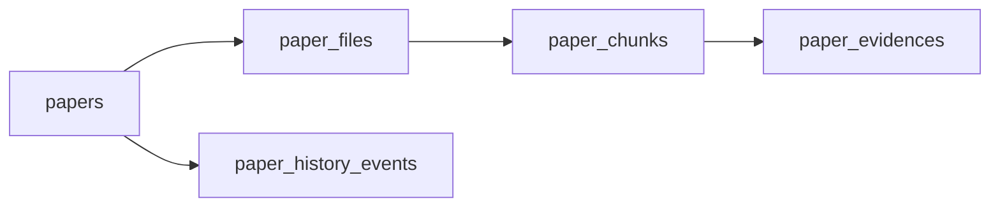

# 领域模型与数据库结构

## 功能说明

定义 SC-Wiki 主业务数据的实体、字段和关联关系，为 API、审核、检索和维护工具提供共同契约。

## 当前行为

### MaterialState 模块化物性与定义版本

Issue #90 新增 `property_modules`、`property_records` 和 `form_definitions`。模块按需挂载在
`MaterialState`，统一记录固定列保存可检索核心事实，`payload_json` 保存本条记录的 Conditions、参数及
预设分组扩展。定义以 `definition_key + version` 唯一标识，发布后不可原地修改；升级和回滚写入不可变
审计事件。`property_record_evidences` 连接记录与当前论文 revision 的 Evidence，管理员提升自定义性质
时另写来源快照和目标定义。

`chemical_systems`、`superconductors`、`material_states`、`property_modules`、`property_records` 和
Evidence 均归属于确定的论文 revision。同名材料不再跨论文共享主键，跨论文检索通过规范化学式、
组成等字段聚合。

迁移采用 Expand、Copy、Reconcile、Final sync、Read switch、Write switch、Observe、Contract 状态机。
Copy 按源表、源 ID 和论文 revision 幂等记录映射与检查点；Final sync 覆盖迁移窗口内的新增、修改、
删除和论文升版。每个阶段只有在逐项对账无未处理异常时才能前进，失败可从最近稳定检查点恢复。
Read switch 验收前保持科学写入停用，Contract 默认拒绝删除旧表，只有显式设置
`ISSUE90_CONTRACT_CONFIRMED=1` 才能进入最终退役。

- Alembic 的 fresh 链可在全新空 MySQL 创建 21 张目标业务表；`0007` 建立论文 revision、
  File、Chunk、Evidence 和审核事件约束，`0008` 建立条件化科学数据模型。
- SQLAlchemy `Base.metadata` 只包含目标表，不再把 `key_properties`、
  `superconductor_records` 或 `superconductors_structures` 纳入 fresh Schema。
- `MaterialState` 表达论文当前 revision 中的材料状态；`StructureModel` 与物性模块在状态下平行。
- `MaterialState.reported_space_group_symbol/number` 保存论文报告但没有完整结构几何时的空间群事实；只有存在真实结构文本时才创建 `StructureModel`，不会为凑必填字段伪造 CIF/POSCAR。
- `MaterialState` 不再包含 `phase_label`、材料家族外键或 `superconductor_kind`；空间群不属于分类树。Material family 是论文 revision 级多选分类，`Paper.superconductor_kind` 是论文 revision 级单选（`conventional`、`unconventional`、`unknown`），结构家族仍是材料状态级多选标签；三者在论文审核内确认。
- `PropertyRecord` 统一保存 Tc、普通物性和计算参数。固定列保存 property identity、值、单位、方法和
  代表标记，`payload_json` 保存记录自带的 `calculation_conditions`、`experimental_conditions`、
  参数与定义允许的扩展字段。
- 预测 Tc 和测量 Tc 由记录类型、方法和 Conditions 类型共同约束；每个“论文 revision +
  MaterialState + Tc 记录类型 + 方法”最多一条代表记录。
- 科学子实体没有独立审核状态。论文一次审核覆盖当前 revision 的 File、Chunk、Evidence、
  结构、Tc 和普通物性；只有 `approved_revision = content_revision` 才具备公开资格。
- Python 与 Go 模型已经映射目标表；上传、管理员重写、公开详情、搜索、统计和导出正常路径均使用
  `PropertyRecord`。旧载荷只在输入边界单向转换，旧科学表不再作为正常读取或写入回退。
- `run_migrations.py` 默认只升级到 `issue90_copy_v1`；未经显式 Contract 确认，不会删除旧科学表。
- 完整迁移状态机已在隔离真实 MySQL 上验证，包括共享材料拆分、幂等恢复、增量同步、读写切换和
  Contract 后删除旧表的访问回归。此验证不表示生产数据库已经部署迁移。

## 工作流程

目标模型由 Alembic、SQLAlchemy 和 GORM 共同描述。Python 上传与管理员重写只写目标契约；Go 详情、
搜索、统计、管理员读取、删除和 MaterialState 导出只读目标科学表。前端上传、管理编辑和详情统一消费
`property_modules[].records[]`，不再把 `key_properties` 或旧上下文表作为第二套权威。

## 化学体系与具体材料的建模边界

- `chemical_systems` 与 `superconductors` 保持为两个独立实体，不合并、不重命名，也不移除两者之间的外键关系。
- `chemical_systems` 表示元素体系，例如 `H-La`；`superconductors` 表示具体化学计量材料，例如同一体系下的 `LaH3`、`LaH6` 和 `LaH10`。两者职责相近但数据粒度不同，维持一对多关系可以明确区分体系与具体材料。
- 当前不通过删除 `chemical_systems`、迁移外键或重写 ORM 与导入流程来简化表结构。现有关系继续服务体系归类、具体材料识别以及下游结构、物性和论文关联。

## 可推导字段的持久化策略

以下字段之间存在可计算关系，但项目有意将它们分别持久化，不在查询时强制重新计算，也不因存在推导关系而删除：

- `chemical_systems.elements_list`：体系层经过确认的元素集合。
- `chemical_systems.system_key`：体系层规范检索键，可由元素集合排序生成，但保留为显式字段。
- `superconductors.elements_list`：具体材料层经过确认的元素集合，与体系层字段语义和复核粒度不同。
- `superconductors.composition`：具体材料中各元素的计量组成。
- `superconductors.element_ratio`：具体材料的元素比例，可由 `composition` 归一化计算，但保留为显式字段。

例如 `LaH10` 可以机械解析为 `composition={"La": 1, "H": 10}`，再推导出 `elements_list=["H", "La"]`、`element_ratio={"La": 1/11, "H": 10/11}` 和体系键 `H-La`。但是含变量、混合占位、非整数计量或非标准写法的材料可能无法由程序可靠解析，机械结果也可能需要人工修订。因此上传和导入阶段应同时生成这些字段，并在入库前由人工检查和调整；读取阶段优先使用已经审核并持久化的结果，避免每次查询重复解析和计算。

重复字段在这里兼具查询缓存和人工校正快照的作用。自动一致性检查可以比较体系元素、材料元素、组成和比例，并报告异常，但不得在没有人工确认的情况下用重新计算结果覆盖已审核数据。发现差异时应保留原值和上下文，由审核流程判断是解析错误、录入错误，还是特殊化学式导致的合理差异。

## 论文、文件、切片、证据与审核事件边界

五张论文相关表表达不同粒度和生命周期，不属于应直接合并的重复表：

| 表 | 当前职责 | 生命周期 |
| --- | --- | --- |
| `papers` | 出版信息、当前内容 revision 和一次整篇审核状态 | 稳定主实体 |
| `paper_files` | 当前 revision 的正文、补充材料或附件元数据 | 当前代文件清单 |
| `paper_chunks` | 当前 revision 中由文件派生的文本块 | 可重建当前代数据 |
| `paper_evidences` | 直接锚定当前 Chunk 的原文证据与定位快照 | 当前代审核证据 |
| `paper_history_events` | 一次论文 revision 的上传、修改或审核不可变历史事件 | 管理端处理记录、审核意见审计与审核贡献统计 |

当前目标 Schema 已落实以下边界：

- `paper_files.stored_path` 是唯一文件路径来源，目标 `papers` 不含 `source_file_path`。
- 每个文件的 `chunk_index` 独立编号；Evidence 通过必填 `paper_chunk_id` 直接引用同论文、
  同 revision 的 Chunk。
- 每篇论文只保留一代 File/Chunk/Evidence。重新分块的目标契约是在同一 MySQL 事务中先按
  依赖删除旧当前代，再递增 revision 并写入完整新当前代；Qdrant 只保存可重建投影。
- `paper_history_events.paper_id` 单列外键指向论文并使用 `ON DELETE RESTRICT`；其 `paper_id, paper_revision` 索引在表名演进时持续保留，以满足 MySQL 外键索引要求。
  `paper_revision` 是历史快照，不与论文当前 revision 建组合外键，因此旧审核事件不阻止升版。

这些约束已经在隔离 fresh MySQL 验证。论文文件重新分块与 Qdrant 投影仍属于各自业务流程边界，
不改变 #90 已完成的关系型物性契约切换。

## 论文叙述字段的语言约定

六个 LLM 叙述字段（`summary`、`keywords_tags`、`methodology`、`key_finding`、`research_motivation`、`knowledge_graph_title`）的事实来源是英文论文原文，因此内容语言统一为英文，不做双语存储（不存在 `*_en` 列），展示也不随界面语言变化（[Issue #74](https://github.com/JLU-ICCMS-MaYuan/SC-Wiki/issues/74)）。界面语言（简体中文/英文）只作用于前端文案与固定枚举标签，与叙述字段内容无关。分类目录项（`material_families`、`structure_families`）则是真正的双语实体：seed 条目齐备 `name_zh` 与 `name_en`；用户自建条目通常只有中文名，英文界面缺 `name_en` 时回退中文名，已知的「单质超导体」目录项已补齐为 `Elemental superconductor`。

## 约束

- 当前 Docker 部署要求 `DATABASE_URL` 指向 MySQL；Python 仍保留 SQLite fallback 逻辑，但 Go 服务要求可解析的 MySQL DSN。
- GORM 与 SQLAlchemy 两套模型需要保持字段一致，否则会出现接口可读写范围不一致。
- RAG 向量数据位于 Qdrant，Neo4j 图数据由同步工具或 `graph.json` 快照支撑，不属于普通关系表字段。
- 目标模型同时支持 fresh 建库和受控历史迁移；生产部署仍须按阶段门禁执行，不以本地验证替代部署确认。
- 运行数据库的逐表字段和关系以 [运行中 MySQL 表目录](mysql-schema-catalog.md) 的实测盘点为准。
- 可推导字段采用“上传时生成、入库前人工复核、读取时直接使用”的策略；不以运行时重复计算替代持久化字段。
- 一致性校验用于发现和提示差异，不自动覆盖人工确认的数据。
- 应用层同样校验 `tc_method` 与 `result_kind` 及条目级 `calculation_context` 的组合；上传草稿、上传提交和管理员科学数据重写会在事务重建前拒绝实验 Tc 的计算上下文，数据库约束负责阻止绕过 API 的写入。

## 论文与材料状态分类

Material family 属于论文当前 revision，通过 `paper_material_families(paper_id, paper_revision, material_family_id)` 建立多对多关系；一篇论文可关联多个 family。`Paper.superconductor_kind` 同样属于论文当前 revision，但为单选且只能是 `conventional`、`unconventional` 或 `unknown`；它不因论文含多个材料状态而重复保存。`Paper type` 及理论论文子分类保持原结构。`material_states` 不再保存 `material_family_id` 或 `superconductor_kind`，每个状态继续独立保存由规范化化学式计算的 `element_count`、`material_dimensionality`、压力和结构家族关联。结构家族即界面中的 `More type labels`，可多选，并通过生成列唯一约束保证最多一个主结构家族。

`material_families`、`structure_families` 及各自 seed 别名表提供确定性目录。普通接口只返回目录 ID 和规范中文名，
不暴露内部 `code`。AI 建议仅作为论文审核上下文，不进入独立建议表；审核者可认可、改选已有目录项或输入新名称。
批准事务在同一事务内解析并去重论文级 family、创建必要的目录项、整体替换正式关联，并把 AI 上下文与最终选择保存到
`paper_history_events.classification_snapshot`。拒绝或退回不创建分类。`papers.referenced_materials` 已从目标 Schema 删除。

## 代码与测试

- `backend/models.py`
- `goserver/models/models.go`
- `backend/database.py`
- `goserver/database/db.go`
- `goserver/config/config.go`
- `alembic/versions/`
- `tests/02_maintenance_and_verification/`

## 相关变更记录

- [Feature #32：条件化结构、计算上下文与 Tc 结果数据模型](../../specs/32-superconducting-data-model/spec.md)
  已完成 fresh Schema、SQLAlchemy/GORM 和隔离 MySQL 验证；API/UI 和历史迁移未完成。
- [Feature #33：论文文件、证据与审核事件完整性收敛](../../specs/33-paper-lineage-integrity/spec.md)
  已完成 fresh Schema、SQLAlchemy/GORM 和隔离 MySQL 验证；RAG/Qdrant 编排和历史迁移未完成。
- [Feature #46：论文上传科学数据结构化](../../specs/46-upload-scientific-data-pipeline/spec.md)
  已完成上传草稿、编辑器和提交事务向条件化科学实体图的切换。
- [Feature #51：材料状态多维分类目录](../../specs/51-material-state-classification/spec.md)
  建立数据库目录、确定性 seed 别名映射、材料状态级分类和审核内人工确认，不迁移旧 655 篇论文数据库。
- [Feature #79：论文级 Material family 多选分类](../../specs/79-paper-material-families/spec.md)
  将 Material family 提升到论文 revision 级多选关联，保留状态级结构家族标签，并提供旧状态数据的去重迁移。
- [Feature #80：论文级 Superconductor type 单选分类](../../specs/80-paper-superconductor-kind/spec.md)
  将 Superconductor type 提升为论文 revision 级单选字段，保留状态级 More type labels 和条件化科学数据。
- [Feature #84：实验 Tc 的条件字段与计算上下文一致性](../../specs/84-experimental-tc-fields/spec.md)
  已将 Tc 方法确定为字段和上下文关联的唯一开关，并增加应用层与 MySQL 的双重约束。
- [Feature #90：MaterialState 模块化物性与动态表单](../../specs/90-unified-superconductor-properties/spec.md)
  已完成统一物性记录、动态定义、跨入口切换、分阶段历史迁移和旧科学表 Contract 收敛。

## 已知问题

- 生产数据库是否已执行 #90 迁移不属于代码仓库可验证事实；部署时必须依次完成 Copy、Reconcile、
  Final sync、读写切换和观察，并在显式确认后执行 Contract。
- 重新分块的单代事务和 Qdrant 删除后重建属于论文/RAG 生命周期，不由 #90 的关系型物性迁移代替。
- `chemical_systems.elements_list` 与 `superconductors.elements_list` 存在有意保留的查询冗余；非标准化学式
  仍需人工复核，但不通过合并表或删除字段解决。

## 科学来源核对与批准

材料状态独立保存可空 `material_name`，与化学式至少填写一项。无化学式时 `superconductor_id` 可空，不创建假化学体系；有化学式时仍验证原关联归属。名称不改变 state_key 的身份含义，只改变本状态相关核对上下文。持久化与同值比较共用状态字段规则，结构家族关联随重建保存；历史名称为空时继续显示化学式。

`scientific_evidence_checks` 保存 upload/paper 目标的全部科学判断、版本和按审核员隔离的裁决草稿。`scientific_upload_drafts` 保存已核对上传的状态与草稿；`scientific_structure_origins` 保存认证提交者及原始结构来源。正式批准由 Go 同事务写 `scientific_evidence_sources`、`paper_evidences` 和审核历史，再删除临时判断。永久来源区分论文引句、提供者附件和程序派生，上传到论文按稳定 item_key 转接，详情见 [#103 数据模型](../../specs/103-property-evidence-review/data-model.md)。

核对规则 v3 增加类型化 `proposal` 和独立 `decision`；旧 v2 结果在原科学覆盖范围内继续复用，不将说明文字当作替换值。`scientific_evidence_checks.resolutions` 的按用户命名空间保存候选、接受状态、理由、原 AI 判断和分阶段提交准备，无额外表迁移。写入前检查准备版本，保存后精确比对实际断言及来源；成功批准才将决定转入永久来源与审核历史并清理临时项。

规则 v4 允许创建 status=unchecked 的理由/候选草稿，读取 v2/v3 原覆盖范围。decision.human_confirmed、accepted、actor_user_id、reason 与 final_content_hash/source_hash 表达独立人工来源；不把未核对或 missing 原 AI 状态改成 supported。人工来源永久保存并以 human_review 发布到 RAG。未核对占位不跳过后续模型任务；规则升级和后台结果不清除已有用户草稿或人工决定。
