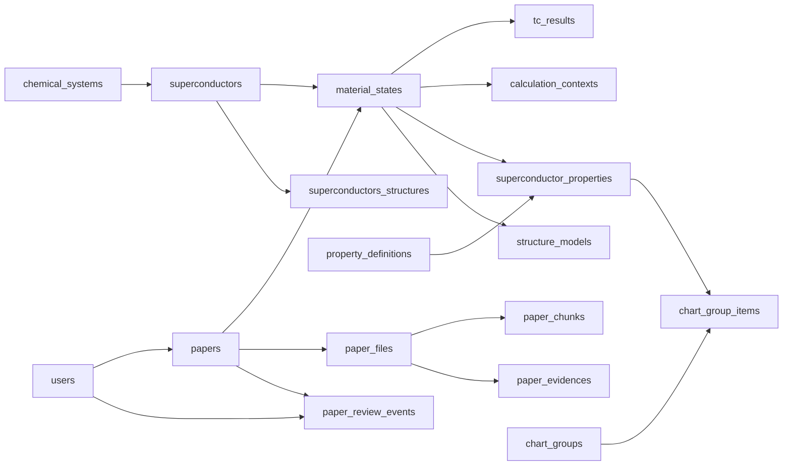

# 运行中 MySQL 表目录

## 功能说明

本文记录两个尚未迁移的现有 MySQL 旧 Schema，用于回答数据库有多少张表、每张表承担什么
职责、包含哪些字段，以及它们与 fresh 目标模型之间是否一致。

本文以 2026-08-21 对运行中 MySQL 的 `information_schema` 只读盘点为依据。记录数来自 MySQL 元数据，只用于表达当前数据规模，可能与精确 `COUNT(*)` 略有差异。

已退役数据集的表说明不再列入维护范围。本次代码清理没有执行数据库删表或数据删除；下列规模与版本是历史盘点值，不代表当前部署的实时状态。

> 注意：Feature #32/#33 已在代码库中落地并通过隔离空 MySQL 验证，但没有部署到本文盘点的
> 现有数据库，也没有迁移其历史数据。因此本文继续保留旧表事实，不用 fresh 目标表覆盖实测结果。

## 当前规模

- 当前实际存在 **18 张基础表**。
- 当前 Alembic 版本为 `20260820_0005`。
- MySQL 保存关系型业务数据；Qdrant 向量、Neo4j 图数据和 Redis 缓存不计入这 18 张表。
- Python 模型定义了 `superconductor_records`，但当前运行数据库没有该表；当前科研数据位于条件化实体表：`material_states`、`tc_results`、`calculation_contexts`、`superconductor_properties`。旧 `key_properties` 表已不存在。

| 分类 | 表 |
| --- | --- |
| 元素、材料与物性 | `periodic_table_elements`、`chemical_systems`、`superconductors`、`material_states`、`tc_results`、`calculation_contexts`、`superconductor_properties`、`property_definitions`、`structure_models`、`superconductors_structures` |
| 论文、文件与审核 | `papers`、`paper_files`、`paper_chunks`、`paper_evidences`、`paper_review_events` |
| 用户与内容 | `users`、`news_items` |
| 旧图表组合 | `chart_groups`、`chart_group_items` |
| 数据库版本 | `alembic_version` |

## 元素、材料与物性

### `periodic_table_elements`

周期表元素基础信息，当前约 118 条。

| 字段 | 含义 |
| --- | --- |
| `id` | 主键 |
| `atomic_number` | 原子序数，唯一 |
| `symbol` | 元素符号，唯一 |
| `english_name`、`chinese_name` | 英文名、中文名 |
| `atomic_mass` | 原子质量 |
| `period_number`、`group_number` | 周期、族 |
| `category` | 元素类别 |
| `created_at`、`updated_at` | 创建和更新时间 |

### `chemical_systems`

元素体系维度表，当前约 362 条，例如 `H-La` 和 `H-S-Se`。

| 字段 | 含义 |
| --- | --- |
| `id` | 主键 |
| `system_key` | 规范化元素体系键，唯一 |
| `elements_list` | 体系元素集合，JSON |
| `element_count` | 元素数量，用于区分二元、三元等体系 |
| `created_at`、`updated_at` | 创建和更新时间 |

### `superconductors`

具体超导材料表，当前约 600 条。

| 字段 | 含义 |
| --- | --- |
| `id` | 主键 |
| `chemical_system_id` | 外键，指向 `chemical_systems.id` |
| `chemical_formula` | 化学式 |
| `formula_normalized` | 规范化化学式，唯一 |
| `display_name` | 展示名称 |
| `elements_list` | 材料元素列表，JSON |
| `composition` | 化学计量组成，JSON |
| `element_ratio` | 元素比例，JSON |
| `created_at`、`updated_at` | 创建和更新时间 |

### `superconductor_properties`

普通物性记录表（Tc 之外的性质），当前 17 条。旧 `key_properties` 表已不存在，其压力、温度、超导类型、代表记录标记等概念在条件化模型中由 `material_states` 承载，结构文本由 `structure_models` 承载。（[Issue #57](https://github.com/JLU-ICCMS-MaYuan/SC-Wiki/issues/57)）

| 字段 | 含义 |
| --- | --- |
| `id` | 主键 |
| `paper_id`、`paper_revision` | 外键，指向论文及其内容修订号 |
| `material_state_id` | 外键，指向 `material_states.id`；物性隶属材料状态 |
| `structure_id`、`calculation_context_id` | 可选外键，指向结构模型与计算上下文 |
| `property_definition_id` | 外键，指向 `property_definitions.id`，提供规范名与规范单位 |
| `material_raw` | 论文原文中的材料名称 |
| `name_raw` | 论文原文物性名 |
| `value_raw` | 原始数值文本 |
| `value_number` | 解析后的数值 |
| `value_min`、`value_max` | 数值范围 |
| `unit_raw`、`canonical_unit` | 原文单位与规范单位 |
| `condition_note` | 条件文字说明 |
| `source_fingerprint` | 来源指纹，用于去重 |
| `created_at`、`updated_at` | 创建和更新时间 |

Tc 不进入本表：临界温度保存在 `tc_results`（当前 23 条），λ 与 ωlog 保存在 `calculation_contexts`，材料与条件保存在 `material_states`（当前 13 条）。

### `superconductors_structures`

材料晶体结构表，当前约 0 条。

| 字段 | 含义 |
| --- | --- |
| `id` | 主键 |
| `superconductor_id` | 外键，指向 `superconductors.id` |
| `pressure_gpa` | 结构对应压力 |
| `space_group_symbol`、`space_group_number` | 空间群符号和编号 |
| `structure_format`、`structure_text` | 结构格式和结构内容 |
| `structure_hash` | 结构哈希 |
| `atom_count` | 原子数 |
| `elements_list` | 元素列表，JSON |
| `cell_parameters` | 晶胞参数，JSON |
| `volume` | 晶胞体积 |
| `review_status` | 审核状态 |
| `is_default` | 是否为默认结构 |
| `source_type`、`source_label` | 来源类型和标签 |
| `created_by_user_id` | 外键，指向 `users.id` |
| `created_at`、`updated_at` | 创建和更新时间 |

## 论文、文件与审核

### `papers`

论文主表，当前约 530 条。

| 字段组 | 字段 |
| --- | --- |
| 标识 | `id`、唯一 `doi` |
| 出版信息 | `title`、`journal`、`volume`、`pages`、`year`、`abstract`、`authors` |
| 上传与审核 | `uploaded_by_user_id`、`reviewed_by_user_id`、`review_status`、`reviewed_at`、`review_comment`、`admin_internal_note` |
| 富化内容 | `summary`、`keywords_tags`、`paper_type`、`methodology`、`key_finding`、`research_motivation`、`knowledge_graph_title`、`theoretical_subtype` |
| 材料关系 | `research_materials`、`referenced_materials`、`material_relations`、`builds_on` |
| 文件和任务 | `source_file_path`、唯一 `upload_task_id` |
| 时间 | `created_at`、`updated_at` |

`uploaded_by_user_id` 和 `reviewed_by_user_id` 均关联 `users.id`。

六个 LLM 叙述字段（`summary`、`keywords_tags`、`methodology`、`key_finding`、`research_motivation`、`knowledge_graph_title`）的内容语言统一为英文，与英文论文原文一致，不存在 `*_en` 双语列；展示不随界面语言变化。`knowledge_graph_title` 已纳入管理员编辑与普通 PATCH 的写入白名单。（[Issue #74](https://github.com/JLU-ICCMS-MaYuan/SC-Wiki/issues/74)）

### `paper_files`

论文正文与附件表，当前约 0 条。

字段为 `id`、`paper_id`、`role`、`original_filename`、`stored_path`、`sha256`、`size`、`media_type`、`sort_order`、`created_at`。`paper_id` 关联 `papers.id`。

### `paper_chunks`

RAG 文本切片元数据，当前约 28432 条；向量本体位于 Qdrant。

字段为 `id`、`paper_id`、`chunk_index`、`section_name`、`heading`、`content`、`token_count`、`paper_file_id`、`page_start`、`page_end`。`paper_id` 关联 `papers.id`，`paper_file_id` 关联 `paper_files.id`。

### 引用图谱表

- `paper_reference_extractions`：按 `(paper_id, paper_revision)` 保存 GROBID 解析状态、解析器版本和错误信息。
- `paper_references`：按论文版本保存原始引文、DOI、题名、作者、年份、匹配状态和可选的 `cited_paper_id`。原始引文不因未入库而丢失，同一来源和目标的重复引文只在图投影和被引计数中去重。
- `paper_graph_marks`：保存管理员维护的 `origin`、`breakthrough` 标记。

引用图只投影当前已审核版本，`papers.year` 为非空字段；`paper_references.year` 允许为空，因为外部参考文献可能无法解析年份。详细契约见 `docs/specs/81-citation-graph/data-model.md`。

### `paper_evidences`

字段提取证据及其原文定位，当前约 0 条。

字段为 `id`、`paper_id`、`paper_file_id`、`field_path`、`chunk_index`、`section`、`page_start`、`page_end`、`quote`、`created_at`。

### `paper_review_events`

论文审核历史事件，当前约 1 条。

字段为 `id`、`paper_id`、`reviewer_user_id`、`status`、`review_comment`、`reviewed_at`、唯一 `request_id`、`source`。审核人关联 `users.id`。

### 五张论文表的职责边界

| 表 | 每行含义 | 当前主要用途 |
| --- | --- | --- |
| `papers` | 一篇论文 | 出版信息、富化结果和当前审核状态 |
| `paper_files` | 论文的一个正文或附件文件 | 文件路径、校验和、大小、角色和顺序 |
| `paper_chunks` | 文件派生的一个文本块 | RAG 检索、原文召回和页面定位 |
| `paper_evidences` | 一个结构化字段的一条证据 | 字段来源、原文快照和定位 |
| `paper_review_events` | 一次审核动作 | 审计历史、幂等和贡献统计 |

这些表的数据粒度和生命周期不同，当前不应直接合并。主表保存当前状态，文件表保存一对多原始文件，
Chunk 是可重建派生数据，Evidence 是字段级证据快照，Review Event 是不可变历史。

当前运行 schema 的完整性边界如下：

- `papers.source_file_path` 与 `paper_files.stored_path` 同时存在，且业务代码仍有旧路径读写；尚未形成单一文件路径权威来源。
- `paper_evidences` 通过可空 `paper_file_id` 和 `chunk_index` 定位来源，没有 `paper_chunk_id` 外键。
- `paper_review_events.paper_id` 有查询索引，但当前数据库未声明指向 `papers.id` 的外键；`reviewer_user_id` 已声明用户外键。

目标迁移和异常处理规则记录在 [Feature #33](../../specs/33-paper-lineage-integrity/spec.md)；在该 Feature
实施并验证前，本文只记录当前 schema，不把目标外键或旧列删除写成已实现事实。

## 用户与内容

### `users`

用户身份、角色和审批信息，当前约 6 条。

字段为 `id`、唯一 `email`、`password_hash`、`real_name`、`affiliation`、`role`、`is_approved`、`is_email_verified`、`verification_code`、`verification_expires`、`approved_at`、`approved_by_user_id`、`created_at`、`updated_at`。`approved_by_user_id` 自关联 `users.id`。

### `news_items`

新闻内容，当前约 4 条。

字段为 `id`、`event_date`、`title`、`summary`、`link`、`created_at`、`updated_at`。

## 旧图表组合

### `chart_groups`

旧图表组合定义，当前约 6 条。

字段为 `id`、`name`、`description`、`is_preset`、`is_public`、`created_by`、`created_at`、`updated_at`。`created_by` 关联 `users.id`。

### `chart_group_items`

旧组合内的数据点，当前约 0 条。

字段为 `id`、`group_id`、`key_property_id`、`sort_order`、`custom_label`、`custom_tc`、`custom_pressure`、`custom_type`、`custom_article_type`、`custom_year`。`group_id` 关联 `chart_groups.id`；`key_property_id` 沿用旧命名，指向物性记录，但旧 `key_properties` 表已不存在（当前物性表为 `superconductor_properties`），该引用的有效性属**待核验**——组合项当前 0 条，未实测过非空场景。

当前存在组合定义但没有组合项，选择组合后可能得到空图。组合名称不能等同于 `superconductor_type`；“近室温”“常压”等数值条件也不是材料类型。

## 数据库版本

### `alembic_version`

字段只有主键 `version_num`，当前值为 `20260820_0005`。

## `chemical_systems` 与 `superconductors` 的职责

这两张表不是完全重复：

- `chemical_systems` 表达元素集合层级，例如 `H-La`。
- `superconductors` 表达具体化学计量、相或材料，例如 `LaH2`、`LaH10` 和 `LaH16`。

当前 362 个元素体系对应 600 个具体材料：

- 261 个体系只有一个材料。
- 101 个体系包含多个材料。
- 单个体系最多包含 13 个材料。

例如 `H-La` 下包含 `LaH`、`LaH2`、`LaH3`、`LaH4+δ`、`LaH6+δ`、`LaH9.63`、`LaH10`、`LaH11`、`LaH16` 和 `LaH18` 等具体材料。因此删除 `chemical_systems` 会丢失元素体系与具体化学式之间的自然一对多分组。

推荐职责边界如下：

| 数据 | 权威位置 |
| --- | --- |
| 规范体系键和元素集合 | `chemical_systems` |
| 二元、三元等元素数量 | `chemical_systems.element_count` |
| 具体化学式和显示名称 | `superconductors` |
| 化学计量组成与元素比例 | `superconductors.composition`、`superconductors.element_ratio` |

`elements_list` 同时出现在两表，属于真实冗余。后续可以选择：

1. 删除 `superconductors.elements_list`，通过 `chemical_system_id` 读取体系元素；或
2. 将其明确为查询加速字段，并增加与 `chemical_systems.elements_list` 的一致性校验。

在迁移和查询影响未经评估前，不应直接删除 `chemical_systems`。

## 关系概览

## 约束与已知问题

- `superconductor_records` 已在 Python 模型中定义，但当前运行 MySQL 未创建该表；依赖它的接口不能假定表已存在。
- 当前 schema 与代码模型并非完全一致，变更查询前必须同时核对运行数据库、Alembic 和 GORM/SQLAlchemy 模型。
- 已观察到 `CaH4`/`CaH₄`、`MgH6`/`MgH₆` 等表现形式重复，以及部分化学式混入说明文字；材料规范化仍需单独审计。
- `system_key` 的元素顺序尚未表现出完全统一的规范，例如同时存在类似 `H-La` 与 `Ce-H` 的顺序风格。
- 删除表、字段或合并记录属于数据库迁移与数据清洗工作，不能只修改模型定义。
- 论文文件路径、Evidence 稳定引用和 Review Event 论文外键的收敛由 [Issue #33](https://github.com/JLU-ICCMS-MaYuan/SC-Wiki/issues/33) 跟踪。

## 代码与证据

- `backend/models.py`
- `goserver/models/models.go`
- `alembic/versions/`
- MySQL `information_schema.tables`
- MySQL `information_schema.columns`
- MySQL `information_schema.key_column_usage`
