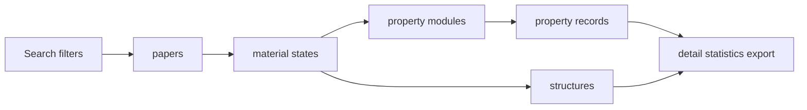

# 论文与物性结果

## 功能说明

把材料检索命中项组织为论文、材料状态和模块化物性记录，供详情展示、统计、导出与审核复用。

## 当前行为

- 详情 API 只通过材料状态下的 `property_modules[].records[]` 返回物性。每条记录包含固定核心字段、
  Conditions、参数、定义键与版本；不再返回 `tc_results`、旧上下文或 `key_properties` 作为第二套契约。
- `GET /api/papers/{paper_id}/material-states/{state_key}/export` 返回同一 revision 的离线 JSON 包，
  包含材料、状态、结构、模块记录、记录 Evidence 和定义快照，不暴露管理员审计字段。查询按
  `paper_id + revision + state_key` 精确定位。
- 新上传提交与管理员重写只写模块化目标模型：`material_states` 保存压力与论文报告空间群，
  `property_records` 保存 Tc、普通物性、Conditions 和参数。
- 材料状态不保存 `phase_label`、Material family 或 `superconductor_kind`；论文顶层保存单选
  Superconductor type，Material family 属于论文 revision，`More type labels` 由状态级结构家族表达。
- 结果主链路为 `papers -> material_states -> property_modules -> property_records`。压强与温度属于材料
  状态，结构文本属于 `structure_models`，物性记录不重复承载这些事实。
- Go API `GET /api/papers/:id` 在论文顶层返回 `material_families[]` 与 `superconductor_kind`，并按材料
  状态嵌套 `structure_families[]`、`structures` 和 `property_modules[]`。
- `tc_max`、搜索结果和统计图表从 `PropertyRecord` 的规范固定列聚合；自定义且未规范化的性质不会
  误入 Tc 聚合。Go API `POST /api/papers/search/records` 返回包含 `record_id`、`paper_id`、`year`、
  `formula`、`type`、`pressure`、`tc`、`space_group`、`source`、`status` 和 `doi` 的扁平列表行。
- `/search` 页面按 `paper_id` 请求论文详情。结构预览读取材料状态下的 `structures`，物性展示统一读取
  `property_modules`。Tc 排在关键物性最前，其后展示记录内参数和其他物性；空值不生成表格行。
- 独立详情、搜索详情与图表抽屉共用按论文 ID 关联的[评论和弹幕](../06_Researcher_Community_Forum/community-discussion.md)，版本更新不会丢失评论。材料状态响应中的 `system_key` 用于跳转跨论文共享的体系讨论；没有元素组合时不生成体系入口。
- 探索页默认不预选元素，Formula 输入框默认为空；只有 URL 显式包含 `elements` 时才预选。
- 论文总结和核心发现以纯文本 `pre-wrap` 显示，保留用户录入的换行，不进行 Markdown 再解释。
- 详情区块中，标签使用紧凑 caption；长文本使用较轻的正文层级，短值字段保持适合扫描的强调层级。
- 知识图谱节点优先使用 `knowledge_graph_title`，缺失时回退论文 `title`。
- 只读论文详情复用共享物性记录组件，每条测量 Tc、预测 Tc 和自定义性质均默认展开且可独立折叠；
  条件、结果等输入保持禁用。标题显示类型、方法、名称和原始值，不显示模板版本后缀。
  实验 Conditions 在一个多行框中显示，优先使用本条记录的 description；旧对象的显示规则见
  [上传数据结构与表单映射](../01_Decentralized_Uploading_of_Superconductivity_Data/data-structure-and-form-mapping.md)。
  折叠仅影响界面，详情 API 和完整导出仍携带全部条件、Evidence 及定义版本。

物性与结构的共用提取逻辑位于 `frontend/src/lib/paperDetailView.ts`。上传只读态、管理员编辑和公开详情
使用同一模块化载荷，避免不同页面各自拼装旧表字段。

## 工作流程

材料检索先按规范化字段确定候选材料和论文。Go API 以目标 `property_records` 的 Tc 固定列关联材料
状态与论文并生成扁平结果，前端展示本地记录。详情阶段按论文 ID 加载完整论文、
结构和按材料状态嵌套的模块记录，供详情、结构预览、审核编辑和图表点击抽屉复用。

## 约束

- Go 搜索、统计、详情、管理员查询和导出的读取投影已切换到模块化目标表，与上传写入契约对齐；
  正常 Handler 在 Contract 后不访问旧科学表。
- 结果准确性取决于 `property_records`、`property_modules`、`material_states`、`superconductors`、
  `papers` 的 revision 关联和审核状态。
- 每条记录的 Evidence 与定义版本必须随详情和导出保持可解释，跨 revision 关联无效。
- 已批准论文的 MaterialState 完整导出要求每条物性记录至少有一条当前 revision 的 Evidence；记录的
  `structure_key` 必须精确匹配同状态导出结构的 `structure-{id}`，否则返回 `409 export_incomplete`。
- `superconductor_records` 不属于当前运行模型，任何读取路径都不得查询该表。

## 代码与测试

- `goserver/handlers/papers.go`
- `goserver/handlers/stats.go`
- `goserver/handlers/material_state_export.go`
- `goserver/models/models.go`
- `backend/api/material_state_export.py`
- `backend/rag/search/sql_search.py`
- `frontend/src/lib/paperDetailView.ts`
- `frontend/src/lib/propertyModules.ts`
- `frontend/src/components/PaperEditView.tsx`
- `frontend/src/components/PropertyModuleEditor.tsx`
- `tests/01_decentralized_uploading/property-record-editor.test.tsx`
- `tests/03_data_search_and_database_discovery/`

## 相关变更记录

- [Feature #46：论文上传科学数据结构化](../../specs/46-upload-scientific-data-pipeline/spec.md)
- [Issue #57：详情与搜索读取投影切换](../../specs/57-paper-detail-data-parity/spec.md)
- [Issue #65：探索页与社区页数据源修复](../../specs/65-search-detail-source-fixes/spec.md)
- [Issue #68：保留论文总结与核心发现换行](../../specs/68-preserve-multiline-text/spec.md)
- [Issue #69：详情长文本视觉层级](../../specs/69-detail-text-hierarchy/spec.md)
- [Issue #70：知识图谱节点专用标题](../../specs/70-knowledge-graph-title/spec.md)
- [Feature #79：论文级 Material family 多选分类](../../specs/79-paper-material-families/spec.md)
- [Feature #80：论文级 Superconductor type 单选分类](../../specs/80-paper-superconductor-kind/spec.md)
- [Feature #90：MaterialState 模块化物性与动态表单](../../specs/90-unified-superconductor-properties/spec.md)
- [Feature #94：物性记录标题、实验条件文本与独立折叠](../../specs/94-property-record-editor/spec.md)

## 已知问题

- 本地列表行的空间群字段当前为占位值，完整结构字段需要从详情或结构接口继续读取。
- 仓库测试能验证 Contract 后正常读取不依赖旧表，但不表示任一生产数据库已经执行迁移。
