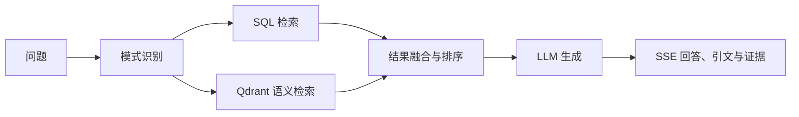

# 检索增强 AI 问答（RAG）

## 功能边界

该功能负责对超导文献数据执行结构化与语义检索，提供流式问答、证据和引文以及灵感探索。它不保证在缺少数据库、Qdrant、Neo4j 或 LLM/Embedding 凭据时可用，也不直接替代人工审核。PDF/TXT/MD 的上传摄入已归入 01 目录。

## 小功能目录

| 小功能 | 职责 | 依赖 |
| --- | --- | --- |
| [可用性与配置](availability-and-configuration.md) | 管理数据、向量库和 LLM 能力开关 | `RAG_DATA_ROOT`、环境变量 |
| [混合检索](hybrid-retrieval.md) | 路由 SQL、向量和融合检索模式 | 异步数据库、Qdrant |
| [流式问答与证据](streaming-qa-and-evidence.md) | 通过 SSE 返回回答、引文和证据事件 | 检索、LLM、React 会话状态 |
| [灵感探索](inspiration-exploration.md) | 生成想法卡片并执行可行性评审 | 检索证据、LLM reviewer |

## 功能组成

```text
检索增强 AI 问答
├── 可用性与配置
├── 混合检索
├── 流式问答与证据
└── 灵感探索
```

## 关联关系



问答可检索的语料来自 01 上传、02 审核通过并经发布向量索引的论文 chunks。

结构化物性统一来自当前已批准版本的 `property_records`；AI 工具、材料详情、检索与统计共用读取规则。
普通问答的流式和非流式接口共用 Mentor，详见[混合检索](hybrid-retrieval.md)与[流式问答](streaming-qa-and-evidence.md)。
