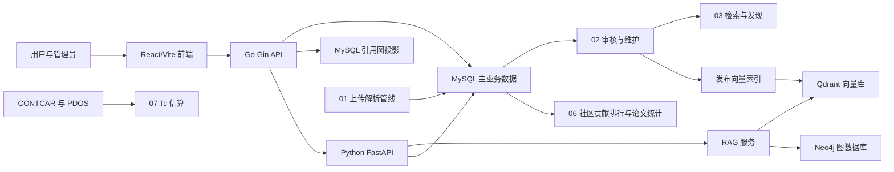

# SC-Wiki 当前功能总览

## 项目说明

SC-Wiki 是面向超导材料研究的数据检索与知识服务应用。当前代码以 React/Vite 提供单页应用，以 Go Gin 服务作为主要公开 API 聚合层，并将未覆盖的接口反向代理到 Python FastAPI 服务；数据库侧同时使用 GORM 与 SQLAlchemy 模型访问 MySQL 中的用户、论文、材料、物性记录、晶体结构和图表组合数据。

当前能力覆盖超导数据去中心化上传（PDF 解析管线）、数据维护与审核验证、本地材料检索、知识图谱、RAG 文献问答、实验性 Tc 估算和研究者社区。部分能力依赖 MySQL、Redis、Neo4j、Qdrant和 LLM/Embedding 配置，具体边界见各功能文档。生产部署使用 Docker Compose，本地开发运行在宿主机进程上（[Issue #71](https://github.com/JLU-ICCMS-MaYuan/SC-Wiki/issues/71)），两条链路的服务组成与启动方式见[部署与运行时](02_Decentralized_Maintenance_and_Verification/deployment-and-runtime.md)。

## 全局导航

上传与管理员编辑共用材料名/化学式至少一项规则；命名材料可没有化学式，当前编辑保存后可逐项填写人工理由确认。详见[上传数据结构](01_Decentralized_Uploading_of_Superconductivity_Data/data-structure-and-form-mapping.md)与[论文审核](02_Decentralized_Maintenance_and_Verification/literature-and-record-review.md)。

所有角色与访客共享左侧导航，页面不再保留全宽顶部栏。SC-Wiki 位于最上方，点击返回默认热点页；下方依次为热点、探索、脉络、社区、上传、对话、预测。社区展开排行榜、Tc~X 演变和讨论，侧栏收起时通过菜单选择。底部留白后依次提供模型配置、中文/英文；已登录者其后可访问通知，管理员与超级管理员另有举报管理，最后为角色入口及头像菜单；访客最后为登录。

侧栏展开为 216px，可向左收起为 64px 图标栏；小于 900px 的窗口默认收起，按钮可随时展开。每个功能有图标与可访问名称，收起后悬停可查看全名。侧栏在页面滚动时保持可见，低高度时可以内部滚动。折叠只改变布局，保留当前页面输入和已选文件；该选择保留于当前页面会话。正文使用侧栏右侧剩余宽度，具体页面仍保留自身排版约束。详见 [Feature #101](../specs/101-unified-collapsible-sidebar/spec.md) 与[使用验收说明](../specs/101-unified-collapsible-sidebar/quickstart.md)。

## 大功能目录

| 大功能 | 职责 | 主要依赖 |
| --- | --- | --- |
| [部署技术分析](00_deploy_technical/README.md) | 当前 Docker 存储与开发部署边界，以及明确区分的服务器部署建议 | Docker Compose、本地运行脚本、持久化存储 |
| [超导快讯与最新论文](news.md) | 官方来源每日采集、稳定标识去重、独立资讯列表与来源状态 | Python、独立 RQ 队列、Redis、MySQL、Go API |
| [超导数据去中心化上传](01_Decentralized_Uploading_of_Superconductivity_Data/README.md) | PDF/TXT/MD 与结构附件的上传、五阶段 AI 解析、校对提交落库 | RQ Worker、Redis、LLM、MySQL、Qdrant |
| [去中心化维护与验证](02_Decentralized_Maintenance_and_Verification/README.md) | 领域模型、迁移、导入导出、部署，论文审核、管理员审批、结构校验 | GORM、SQLAlchemy、Alembic、MySQL |
| [超导数据搜索与数据库发现](03_Superconductivity_Data_Search_and_Database_Discovery/README.md) | 本地材料检索、结果分享导出、代表结构下载、Tc 统计图表 | Go API、主业务数据库 |
| [超导论文引用发展知识图谱](04_Superconductivity_Development_Knowledge_Graph/README.md) | 基于 MySQL 引用事实的分类概览、搜索和分页展开 | Go API、Python Worker、GROBID、MySQL |
| [检索增强 AI 问答](05_Retrieval-Augmented_AI_Question_Answering/README.md) | 混合检索、流式问答、证据展示和灵感探索 | Python FastAPI、MySQL、Qdrant、LLM 配置 |
| [研究者社区论坛](06_Researcher_Community_Forum/README.md) | 注册登录、贡献排行、材料家族及年度论文统计、问答、体系与论文评论、通知及举报管理 | Go API、JWT、MySQL、Redis |
| [AI 辅助 Tc 估算](07_AI_Assisted_Tc_Estimation/README.md) | 根据 CONTCAR 与 PDOS 文件计算实验性 Tc 估算和解释特征 | pymatgen、NumPy、上传文件 |

## 整体关系

主业务数据库是上传、审核、检索、结构和统计能力的共同事实来源。Go 服务负责大部分用户可见 API、缓存和权限路由，未匹配请求转发到 Python 服务；Python 服务继续承担 RAG、结构 API、Tc 估算和 Neo4j 工具接口。Tc 估算只处理用户上传的计算文件，不会自动回写主业务数据。

## 当前边界

- Docker 部署入口使用 Nginx 前端、Go API、Python RAG、上传 Worker、MySQL、Redis、Neo4j、Qdrant、GROBID 和迁移服务；本地直接运行 Python FastAPI 时只包含 Python 注册的接口。
- 本地应用、数据库和 GROBID 均由宿主机进程运行，`make deploy` 准备依赖与数据，`make start` 编排；本地链路不需要 Docker。前端/Python/goserver 和上传 Worker 支持代码变更重载，数据存放仓库内 `.data/`。本地链路以 Vite 代理替代 Nginx；由于生产镜像会重新构建源码，本地改动不会因此丢失，但 nginx 特有的上传体积与缓冲配置、以及仅构建期生效的分包与预取优化在本地不成立，两条链路的行为差异见[部署与运行时](02_Decentralized_Maintenance_and_Verification/deployment-and-runtime.md)。官方依赖下载仍需网络，完整机器验收边界见 `docs/local-dev.md`。
- `backend/main.py` 注册 Tc、结构、RAG、上传任务、证据核对、知识图谱、内部管理、表单定义与材料状态导出等 Python 路由；canonical `/api/upload-tasks` 和 `/api/rag/evidence` 由 Go 未匹配路由转发到 Python。邮箱验证、用户中心、公开资料与管理员治理由 Go 直接承载；图表组合导入/导出/复制/搜索等前端调用仍需按实际部署链路继续核验。
- RAG 已从 Chroma 迁移到 Qdrant 封装，但部分兼容命名仍保留 `chroma` 字样。
- RAG 结构化物性工具、材料详情、检索和统计统一读取当前已批准的 `property_records`；普通流式/非流式问答共用 Mentor。读取规则及外部索引边界见[混合检索](05_Retrieval-Augmented_AI_Question_Answering/hybrid-retrieval.md)。
- 晶体结构后端 API 已实现，前端在论文详情中按材料状态下的 `structures`（来自 `structure_models`）展示结构，完整结构审核工作台仍未从当前路由中确认。当前全库无结构模型记录，只验证过空态。（[Issue #57](https://github.com/JLU-ICCMS-MaYuan/SC-Wiki/issues/57)）
- “社区”展开排行榜、Tc~X 演变和讨论；[科研交流](06_Researcher_Community_Forum/community-discussion.md)包含问答、体系与论文评论、站内通知及举报管理。旧 `/share` 进入图表，图表组合的编辑入口在管理页。
- Tc 估算由代码明确标记为实验页面，不构成模型科学有效性的保证。
- 引用发展图不依赖 Neo4j：GROBID 在上传 Worker 中解析参考文献，MySQL 保存原始记录和匹配状态，Go API 直接查询公开引用图。旧 Neo4j 图谱仍供历史材料/作者关系功能使用。
- 账号身份与分级工作台变更已通过 Go 全量测试、Vitest、前端生产构建和 Alembic MySQL 离线迁移 SQL 生成；真实 SMTP、持久化 MySQL 与完整部署链路仍需在目标环境验收。
- 界面支持简体中文与英文切换：侧栏底部模型配置下方的 `中文 / English` 控件，收起后通过语言图标打开选择菜单。偏好存浏览器 `localStorage`（键 `sc-wiki.language`），默认中文，未登录也可切换；仅界面文案与固定枚举标签跟随语言。六个 LLM 叙述字段（`summary`、`keywords_tags`、`methodology`、`key_finding`、`research_motivation`、`knowledge_graph_title`）在数据层统一为英文存储，不随界面语言变化，无双语列。（[Issue #74](https://github.com/JLU-ICCMS-MaYuan/SC-Wiki/issues/74)、[布局更新 #101](../specs/101-unified-collapsible-sidebar/spec.md)）

## 文档维护

上传提交和两工作台批准共用科学数据来源核对：核对与提交独立，管理员可对当前内容逐条说明理由确认；编辑页先保存新值，再将人工确认绑定当前版本。
操作流程见[PDF 解析管线](01_Decentralized_Uploading_of_Superconductivity_Data/pdf-parsing-pipeline.md)与
[论文与记录审核](02_Decentralized_Maintenance_and_Verification/literature-and-record-review.md)。

本目录只记录当前代码、配置和测试文件能够支持的已落地事实。未来方案位于 `future-plan/`，不作为当前能力依据。无法从当前实现确认的内容在相应文档中标记为“待核验”。

按用户要求，[部署技术分析](00_deploy_technical/README.md) 同时讨论后续部署建议；其中建议与当前事实分开标明，不作为已实现能力或任务完成状态。
